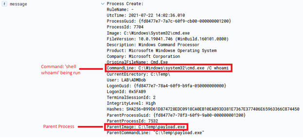
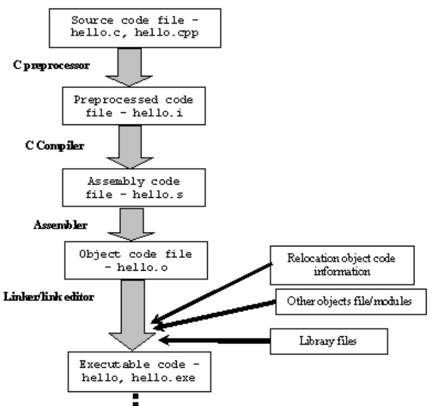

# 후속 공격의 진화

## 후속 공격(Post-Exploitation)이란 

후속 공격이란 초기 침투 이후 공격자가 침투한 시스템내에서 행하는 추가적인 활동을 일컫는다. 호스트와 네트워크내의 정보를 수집하거나, 권한 상승을 통해 더 높은 권한을 확보하거나, 지속성을 확보하는 등의 활동이 포함된다.

현대 공격자들의 후속 공격은 대부분 초기침투시 확보한 엔드포인트에서 실행 중인 C2 (Command-and-Control) 프레임워크의 에이전트(Agent), 혹은 임플랜트(Implant)에서 이뤄진다. 예를 들자면 코발트 스트라이크를 사용하는 공격자라면 비컨(Beacon)을, BruteRatel을 사용한다면 뱃져(Badger)를, 하복(Havoc) 프레임워크를 사용한다면 데몬(Demon)등의 에이전트에서 후속 공격을 실행 할 때가 많다.

공격자들이 에이전트 내에서 실행하는 후속 공격의 TTP는 계속해서 발전되어 왔다. 이 페이지에서는 가장 많이 쓰였던 후속 공격의 기법들에 대해 알아본다.

1. 온-디스크 바이너리 드랍
2. Reflective DLL Injection
3. cmd.exe 및 powershell.exe 등의 쉘
4. Fork & Run
5. Execute-Assembly
6. Beacon Object Files

## 온-디스크 바이너리 드랍

<figure><figcaption></figcaption></figure>

온-디스크 바이너리 드랍은 시스템의 파일시스템 위에 후속 공격을 실행할 PE 파일을 업로드 시킨 뒤 실행하는 방법이다. DFIR 보고서 등에 자주 나오는 "공격자들은 `adfind.exe`를 시스템에 업로드 한 뒤 실행해 네트워크 정보 수집을..." 할 때 바로 그 방법이다. 가장 오래된 방법이자, 딱히 기법이라고도 부르기 민망할 수준의 후속 공격이다.

과거 엔드포인트 보안이 정적 분석 정도의 안티바이러스 수준에 머물러 있을 때 가장 많이 사용됐던 기법이다. 최근에는 EDR 솔루션의 발전, Attack Surface Reduction (ASR), 그리고 Windows Defender Application Control (WDAC) 등의 응용프로그램 제어 및 관리하는 기술들이 많아짐에 따라 높은 수준의  공격자들은 거의 사용하지 않게 된 기법이기도 하다.

## Reflective DLL Injection

Reflective DLL Injection(RDI)은 2008년 Harmony Security의 [Stephen Fewer가 발표](https://www.exploit-db.com/docs/english/13007-reflective-dll-injection.pdf)했다. RDI는 DLL을 원격 프로세스 메모리에 주입한 뒤, 간단한 PE파일 로더를 DLL의 exported function 중 하나에 구현해 DLL이 스스로 해당 프로세스의 메모리상에 로드/맵핑하도록 하는 기법이다. 2008년 당시로서는 인-메모리 공격(혹은 Fileless 공격)이라는 개념조차 생소했기 때문에 모든게 메모리상에서 이뤄지는 RDI는 탐지가 어려웠었다.

<figure><figcaption>
출처: https://www.giac.org/paper/gcfa/11563/hunting-ghosts-fileless-attacks/150888
</figcaption></figure>

하지만 RDI의 경우 로드된 DLL의 메모리 영역이 디스크위의 파일에 의해 지원되지 않는다(memory region that is unbacked by file on disk). 일반적인 DLL이라면 디스크(파일시스템)에 존재하며, 윈도우 PE 로더가 이를 로드하면 프로세스 메모리에 `IMAGE` 플래그와 함께 맵핑이 된다. 그러나 RDI로 로드된 DLL의 경우 완전히 메모리상에서 로드가 됐기 때문에 메모리 영역이 `Private` 플래그를 갖게된다.

이외에도 DLL 로드 함수가 맨 처음 `LoadLibraryA, GetProcAddress, VirtualAlloc` 등의 win32api를 커널의 export table에서 찾은 뒤 사용한다는 점, 프로세스의 특정 메모리 범위를 RWX로 바꾼다는 점, DLL이라는 PE파일을 통째로 메모리상에 로드한다는 점 등의 아티팩트를 기반으로 한 탐지 기법들이 15년 동안 많이 나오며 요즘에는 잘 사용되지 않는다. 대부분 User-Defined Reflective Loader에 많이 사용되고 있으며, 후속 공격에 사용될 경우 각 C2 프레임워크마다 순정 RDI에서 약간 기법을 바꿔 사용하고 있다.

## Cmd.exe 및 Powershell.exe 등의 쉘 사용

에이전트가 속한 프로세스로부터 cmd.exe, powershell.exe 등의 쉘을 실행해 추가적인 프로세스나 커맨드를 실행하는 방법이다. 특히 파워쉘의 경우 2010년 Defcon 18때 David Kennedy와 Josh Kelley의 전설적인 ["Powershell...omfg"](https://www.youtube.com/watch?v=q5pA49C7QJg) 발표 이후로 폭발적으로 많이 늘어났다. 예를 들어 흔히들 많이 알고 있는 PowerSploit, Empire, PowerTools, Nishang, Invoke-mimikatz 등의 툴들이 나온 것이 이때(2010\~2015)쯤이다.

cmd.exe의 경우 가장 기본적인 형태의 후속 공격을 진행할 수 있다. cmd.exe 프로세스를 실행한 뒤, `/C` 등의 플래그를 이용해 특정한 프로세스나 커맨드를 실행하는 방법이다. 예를 들어 코발트 스트라이크 비컨의 경우 `whoami` 명령어를 실행하면 비컨이 자식 프로세스로 `cmd.exe`를 생성한 뒤 whoami 명령어를 실행한다. 더 정확하게는 비컨이 `c:\windows\system32\cmd.exe /C whoami`의 라는 자식 프로세스를 실행한 뒤, 결과값을 반환받는 형식이다.

<figure><figcaption>
출처: https://hausec.com/2021/07/26/cobalt-strike-and-tradecraft/
</figcaption></figure>

파워쉘도 마찬가지다. `powershell.exe` 혹은 `System.Management.Automation.dll`의 수정된 버전의 `PowerShdll`/`NoPowerShell.dll` 등의 라이브러리로 파워쉘을 실행한 뒤, 다른 파워쉘 스크립트들을 메모리상에 로드해 사용하는 방식이다.

이와 같은 방법은 프로세스 부모/자식 관계를 분석함으로서 탐지 할 수 있다. 예를 들어 `OneDrive` 프로세스에 인젝션 된 비컨이 `cmd.exe`를 사용한다면, `OneDrive - cmd.exe` 등의 프로세스 부모/자식 관계가 만들어질 것이다. 이는 방어자 입장에서 굉장히 수상하게 보일 수 밖에 없다. 파워쉘의 경우 한창 유명할 2010년 \~ 2016년도까지는 꽤나 자주 쓰였던 기법이지만, 요새는 거의 안쓰이는 기법이기도 하다. 워낙 파워쉘과 관련된 방어 기법들과 모니터링(Script-Block logging, AMSI, CLM, 등)이 심화되었기 때문이다.

우스갯소리로 레드팀 신입들이 가장 많이 하는 실수 중 하나가 기껏 초기침투에 성공한 뒤 비컨에서 `whoami` 명령어를 치는 것이라는 말도 있다. 그만큼 쉘을 사용한 후속 공격은 최근에는 굉장히 높은 확률로 탐지가 되고 있다.

## Fork & Run

<figure><figcaption>
출처: <a href="http://www.it.uu.se/education/course/homepage/os/vt18/module-2/process-management/">http://www.it.uu.se/education/course/homepage/os/vt18/module-2/process-management/</a>
</figcaption></figure>

Fork & Run은 희생할 더미 프로세스를 생성하고 후속 공격과 관련된 shellcode/DLL을 원격 프로세스 인젝션 해 실행 한 뒤, 결과값을 네임드 파이프(named pipe)를 통해 받아오는 후속 공격 기법이다. 왠만한 탐지 기법을 우회하기 위해 생성할 프로세스 이름, 프로세스 Argument, 부모 프로세스 ID (PPID), 프로세스 인젝션 기법, 네임드 파이프 이름까지 모두 Malleable PE 프로필로 바꿀 수도 있다.

예를 들어 `OneDrive.exe` 프로세스에서 현재 비컨이 실행중이라고 가정해보자. 이때 Fork & Run을 잘 설정해 실행한다면 꽤나 설득력 있는 부모-자식 프로세스 관계 및 흔하지 않은 프로세스 인젝션을 통해 방어자들을 속일 수도 있을 것이다.

1. PPID 스푸핑을 통해 실행할 자식 프로세스의 PPID를 `connhost.exe` 로 변경
2. 자식 프로세스의 이름을 `WerFault.exe` 로 변경
3. 프로세스 인젝션 기법을 MapViewOfFile + SetThreadContext 로 변경
4. 필요시 (in)direct syscall, Call Stack Spoofing 사용&#x20;

Fork & Run의 경우 꽤나 많은 C2 프레임워크들이 오랫동안 사용하고 있는 기법이다. 후술할 `execute-assembly` 에도 쓰이고 있다. 그러나 2020년을 전후로 많은 EDR 솔루션들이 커널 콜백 함수들을 이용해 커널 랜드로 다시 진입하면서, 프로세스를 생성해야하는 Fork & Run는 점점 사용하기 어려워지고 있다. 예를 들어 프로세스 생성은 `PspCreateProcessNotifyRoutine` 로, (프로세스 인젝션을 Thread Creation을 통해 한다면) 쓰레드는 `PspCreateThreadNotifyRoutine`로, 추가적인 이미지 로드가 있다면 `PspLoadImageNotifyRoutine` 등의 커널 콜백 함수들을 이용하면 Fork & Run을 꽤나 높은 확률로 탐지하고 방지 할 수 있게 됐다.

따라서 Fork & Run은 요즘에도 많이 사용되기는 하지만, 대체적으로 비싼 작전보안 값(OPSEC-expensive)을 치뤄야하는 기법으로 평가받는다.

## Execute-Assembly

2016년쯤부터 파워쉘 방어 매커니즘(Constrained Language Mode, Script-Block Logging, AMSI, 등)들이 많이 소개되고, 방어자들 도한 파워쉘을 집중적으로 모니터링 하기 시작하면서 공격자들은 점점 파워쉘에서 벗어나 .NET(C#, IronPython, Boolang) 과 관련된 툴링으로 넘어가기 시작했다. 점점 .NET 어셈블리들을 메모리상에서 실행해야될 필요성이 높아졌고, 이를 해소하기 위해 나온 기법이 바로 2018년 4월 [코발트 스트라이크 3.11](https://download.cobaltstrike.com/releasenotes.txt)에서 소개된 execute-assembly다.

Execute-Assembly는 기본적으로는 Fork\&Run 기법과 동일하게 더미 프로세스를 생성한다. 이때 프로세스가 .NET 기반이 아닌 unmanaged 프로세스라면 `CLRCreateInstance` 함수를 이용해 CLR(Common Language Runtime)을 해당 프로세스에 로드한다. 만약 .NET 기반의 프로세스라면 이미 윈도우 운영체제에서 CLR을 로드했기 때문에 이 단계를 넘어간다. 이후 페이로드를 실행할 CLR AppDomain을 생성한 뒤, 페이로드를 메모리로 옮기고, `AppDomain.Load()` 를 이용해 로드한 뒤 페이로드의 EntryPoint를 실행한다. 결과값은 네임드 파이프를 통해 에이전트로 전송된다.

Execute-Assembly 또한 2018년부터 2020년대 초반까지 많이 쓰이던 기법이고, 아직까지도 많은 공격자들이 사용하고 있다. 그러나 CLR을 로드하는데서 나오는 다양한 아티팩트, 앞서 Fork\&Run에서 언급했던 다양한 커널 콜백 함수들, 그리고 ETW(Event Tracing for Windows)에서 많은 종류의 .NET 모니터링을 제공함으로서 점점 사용하지 않게 되고 있다.

공격자들은 이에 대응하기 위해 BOF(Beacon Object File)등을 이용한 [InlineExecute-Assembly](https://securityintelligence.com/posts/net-execution-inlineexecute-assembly/) 와 같은 기법들을 사용하고 있다.

## Beacon Object File (BOF)

Beacon Object File(BOF)는 2020년 6월 [코발트 스트라이크 4.1](https://download.cobaltstrike.com/releasenotes.txt)에서 새롭게 추가된 후속 공격의 한 종류다. BOF는 소스코드를 컴파일(Compiling)과 어셈블(Assembling)을 했지만, 링킹(Linking) 하기 전 상태인 COFF(Common Object Filie Format) 형태의 오브젝트 파일(`.o, .obj`)을  에이전트가 자신의 프로세스에 로드한 뒤 실행하는 기법이다.

<figure><figcaption>
출처: http://nyuray.blogspot.com/2009/01/compilers-assemblers-linkers.html 
</figcaption></figure>

사실상 Reflective DLL Injection의 오브젝트 파일 버전이라고 생각하면 된다. 에이전트 안에 윈도우의 PE Loader와 비슷한 기능을 집어넣은 뒤, 메모리상에서 COFF 오브젝트 파일을 실행한다. 대략적인 방법은 다음과 같다.

1. BOF를 에이전트에게 전송한다 (혹은, 이미 에이전트에 모듈 형태로 존재한다)
2. 에이전트는 윈도우 운영체제의 PE Loader과 비슷한 기능을 사용해 BOF의 COFF를 파싱한다.
3. 파싱이 끝난 뒤 메모리를 할당하고, BOF를 로드한다. 앞서 파싱했던 COFF의 섹션을 차례대로 옮긴다. 로드를 할 때 필요한 Relocation 등을 처리한다.
4. 파싱된 COFF 중 심볼 테이블에서 실행하고자 하는 함수의 메모리 주소를 찾은 뒤 #3번에서 로드된 BOF에서 주소를 찾은 뒤, 함수 포인터를 만들어 BOF안의 함수를 실행한다.

BOF의 경우 1) 새로운 프로세스를 생성하지 않고 2) 굉장히 적은 메모리를 사용하며 3) 프로세스 인젝션이 없어 불필요한 (in)direct syscall 및 win32api를 사용하지 않고 4) 굉장히 빠른 시간내에 실행되기 때문에 2020년도부터 현재(2023)까지 가장 탐지가 어렵고 까다로운 기법으로 남아있다.

또한, BOF를 만들어놓기만 하면 다른 BOF 기능이 있는 C2 프레임워크에서 사용할 수 있기 때문에 사실상 C2 플랫폼에 구애받지 않는 (C2-Agnostic) 후속 공격 기법이라는 평을 받고 있기도 하다. 예를 들어 호스트 정보수집을 진행하는 `hostenum-bof` 를 만들었다면 코발트 스트라이크, 메타스플로잇, Sliver, Nighthawk, BruteRatel 등의 BOF 기능을 갖춘 모든 C2 프레임워크에서 사용할 수 있다는 것이다. 공격자들이 항상 꿈꿔오던 기법이라고도 볼 수 있다.

BOF는 추후 다른 페이지에서 좀 더 깊게 다룰 예정이다.

## 마치며

C2 에이전트 기반의 후속 공격은 지난 30년간 굉장한 발전을 해왔다. 어린 아이도 할 수 있는 디스크 위 바이너리 드랍부터 사실상 윈도우 운영체제의 PE Loader를 에이전트에서 구현해놓은 BOF까지, 상상도 할 수 없을 정도로 빠르고 복잡하게 발전하고 있다. 방어자들 또한 진화하는 공격자들을 막아내기 위해 부모-자식 프로세스 관계, 파워쉘 방어 기술, 유저랜드 후킹, 커널 콜백 함수, 미니필터, ETWti 등을 활용하고 있다. 앞으로도 계속될 창과 방패의 대결을 기대하며 글을 마친다.

### 레퍼런스

* https://www.cobaltstrike.com/blog/writing-beacon-object-files-flexible-stealthy-and-compatible/
* https://www.trustedsec.com/blog/coffloader-building-your-own-in-memory-loader-or-how-to-run-bofs/
* https://github.com/Octoberfest7/Inline-Execute-PE
* https://www.trustedsec.com/blog/bofs-for-script-kiddies/
* https://www.trustedsec.com/blog/changes-in-the-beacon-object-file-landscape/
* https://securityintelligence.com/posts/net-execution-inlineexecute-assembly/
* https://iwantmore.pizza/posts/PEzor4.html
* https://0xboku.com/2021/08/19/Bof-WhereAmI.html
* https://github.com/Cracked5pider/CoffeeLdr
* https://www.trustedsec.com/blog/a-developers-introduction-to-beacon-object-files/
* https://cerbersec.com/2021/08/26/beacon-object-files-part-1.html
* https://securityintelligence.com/posts/how-to-hide-beacon-during-bof-execution/
* https://www.giac.org/paper/gcfa/11563/hunting-ghosts-fileless-attacks/150888
* https://www.mdsec.co.uk/2020/03/hiding-your-net-etw/
* https://www.mandiant.com/resources/blog/silketw-because-free-telemetry-is-free
* https://andreafortuna.org/2018/09/24/some-thoughts-about-pe-injection/
* https://hausec.com/2021/07/26/cobalt-strike-and-tradecraft/

