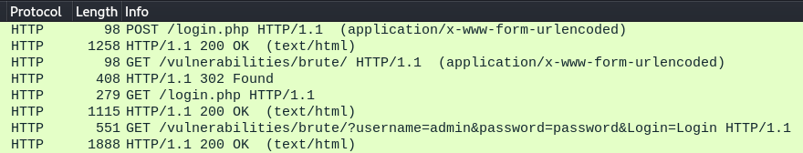
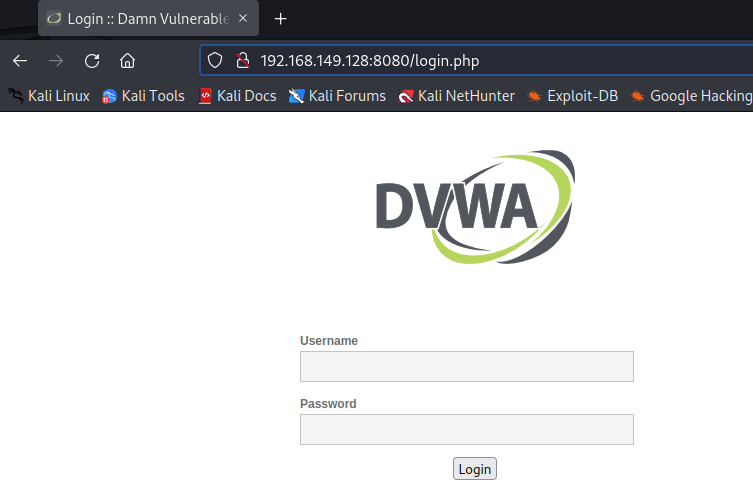
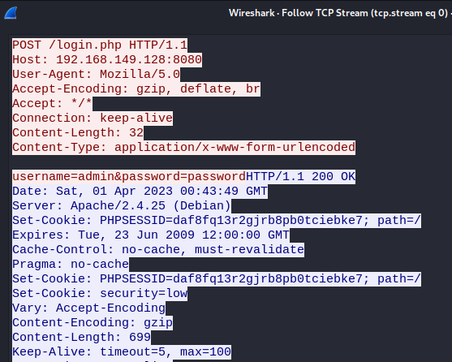
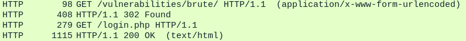
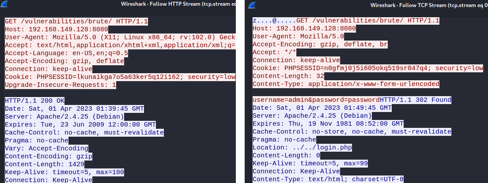
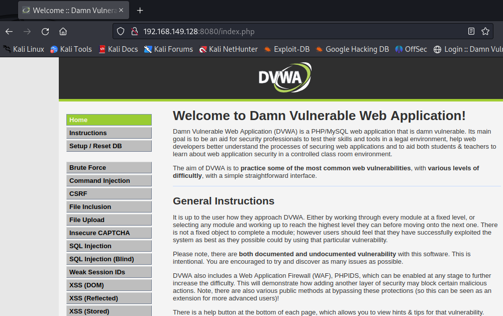
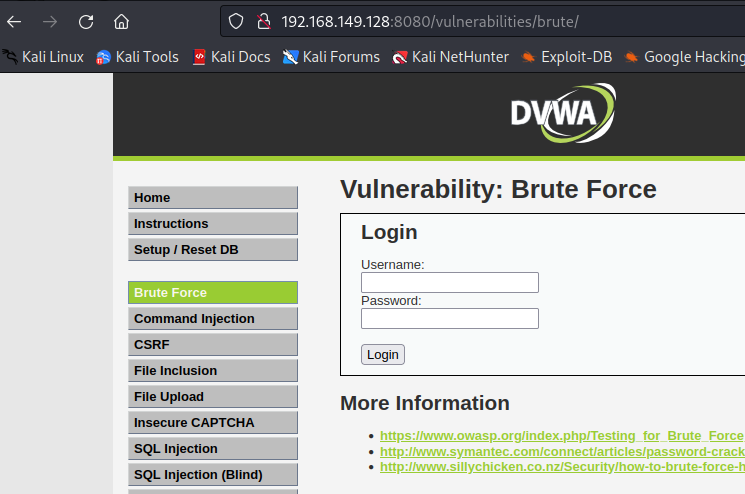
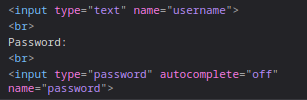

# 통신 과정 흐름 훑어보기

메인화면에서 로그인을 먼저 성공 해야 하고 그 다음 페이지에서 무차별 공격 시도를 진행해서

공격이 성공을 해야 한다.

통신을 비교해보자

<figure><figcaption></figcaption></figure>

첫번째, 메인화면에서 로그인이 성공 된 패킷을 확인 할 수 있다.

<figure><figcaption></figcaption></figure>

<figure><figcaption></figcaption></figure>

<figure><figcaption></figcaption></figure>

그러나 그 다음 하위 url인 /vulnerabilities/brute에서 302 Found 에러가 뜨고

이어서 메인 로그인 화면으로 리다이렉션이 되는 것을 확인 할 수 있다.

<figure><figcaption></figcaption></figure>

정상적인 통신의 패킷과 302에러가 뜬 패킷의 비교 이미지이다.

302는 주로 리다이렉션 에러가 났을때 뜨는 경우인데

<figure><figcaption></figcaption></figure>

302 Found 에러가 뜨는 패킷을 정상 패킷과 비교하면

정상통신은 아래 데이터 값이 안들어가는데 비해, 302 Found 에러가 뜨는 패킷은username=admin\&password=password 데이터 값이 들어가 있는 것을 확인 할 수 있다.

그럼 302 Found 에러가 뜨는 방식으로 똑같이 접근을 진행해보자

페이지에서 직접 시도를 진행해보면 아래 이미지와 같이 192.168.149.128:8080/vulnerabilities/brute가

아닌, 192.168.149.128:8080/index.php의 주소로 먼저 들어가는 것을 확인할 수 있는데

<figure><figcaption></figcaption></figure>

해당 페이지에서 Brute Force 페이지로 접근을 해아하고

<figure><figcaption></figcaption></figure>

이 페이지에서 username과 password 입력 박스 창의 소스 코드를 보면

input type="text" name="username" 과

input type="password" autocomplete="off" name="password"

소스 코드를 확인 할 수 있는데

<figure><figcaption></figcaption></figure>

접근 시도가 잘못 이루어져서 패킷이 위와 같이 에러형태로 통신이 이루어진 것이다.

메인화면에서 로그인이 성공 한 것 까지는 좋은데 하위 url 값이 제대로 안들어가서

성공이 안되고 계속 /login.php 처음 페이지로 리다이렉션이 된 것이다.

그럼최종적으로 해야 할 것은

### 첫번째: 192.168.149.128:8080/login.php로 접근을 성공해야 한다.

\-> 성공

### 두번째 : 로그인이 성공 되면 192.168.149.128:8080/index.php 페이지로 접근이 ok 되어야 한다.

\-> 메인 로그인 화면에서 세선과 프록시을 유지하면서 다음 화면인 /index.php 화면으로 접근이 되게끔 성공 해야 한다.

### 세번째 : 192.168.149.128:8080/vulnerabilities/brute로 이동을 하여

input type="text" name="username" 과

input type="password" autocomplete="off" name="password"에 맞게

자동적으로 무차별 대입 공격을 실행하는 소스코드를 작성하고 테스트를 해서 성공해야한다.

\-> payload 설정방법과nput type에임의의 값을 넣어 무차별 대입 식으로 돌아가게끔 소스 코드를 작성 하는 방법을 인지하고 test를 진행하여 만들어야 한다.
