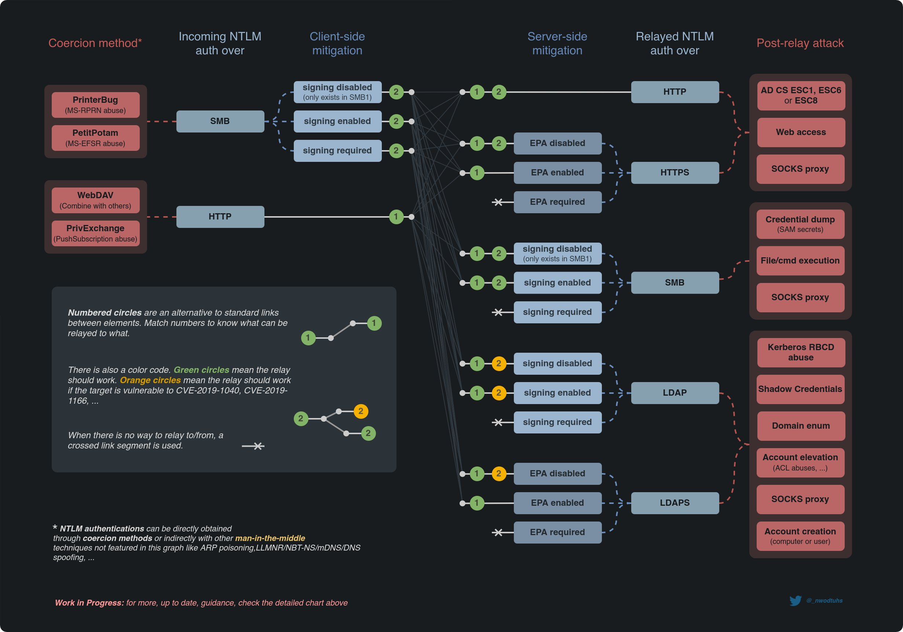

# NTLM 릴레이

LLMNR/Nbt-NS/mDNS, MITM6, RPC 기반 강제 인증 등으로 공격자 머신에게 들어온 인증 트래픽은 릴레이 공격을 통해 다른 머신들의 SMB, HTTP(S), LDAP(S) 등의 다양한 서비스로 릴레이 할 수 있다. 이때 공격자는 중간자 위치에 있기 때문에 피해자 호스트의 맥락으로 해당 서비스들을 이용할 수 있게 된다.&#x20;

릴레이 공격의 종류는 다음 [@nwodtuhs](https://twitter.com/\_nwodtuhs/) 라는 분이 만든 NTLM 릴레이 공격 다이어그램을 참고한다. &#x20;

릴레이가 시작 되는 부분은 강제 인증, LLMNR/Nbt-NS 포이즈닝, MITM6 등의 공격으로 들어오는 SMB 인증 트래픽일 때가 많다. HTTP 인증 트래픽도 WebDav 등을 통해서 들어올 수 있지만, 그렇게 많지는 않다.&#x20;

* SMB -> SMB - 모의해킹 시 가장 자주 이용되는 릴레이 공격이다. 릴레이 되는 호스트의 SAM 데이터베이스를 덤프하거나, SOCKS PROXY 를 구축하거나, 원격 코드를 실행하는 용도로 사용된다.&#x20;
* SMB -> HTTP - 강제 인증과 Active Directory Certificate Services (ADCS) 공격을 할 때 자주 이용된다. 뿐만 아니라 다양한 HTTP 기반 웹 서비스들을 이용할때도 사용할 수 있다.&#x20;
* SMB -> LDAP - 커버로스 기반의 RBCD 공격이나 프록시, 계정 생성, 도메인 정보 수집 등에 사용되는 릴레이 공격이다. 단, 릴레이 되는 도메인 컨트롤러가 CVE-2019-1040 / CVE-2019-1188 에 취약해야지 사용이 가능하다.&#x20;

### 대응 방안 &#x20;

NTLM 릴레이의 대응 방안은 여러가지가 있지만, 기본적으로는 마이크로소프트사에서 지원하는 Message Signing 및 EPA를 적용하는 것이 가장 효율적으로 방어할 수 있는 방법이다. 아주 가끔 NTLM 인증 자체를 버리고 커버로스 + ADCS 만 구축해놓은 액티브 디렉토리도 있지만, 이 방법은 하위 호환성을 전혀 생각하지 않기 때문에 모든 프로그램/솔루션들을 따로 설정해야한다.&#x20;

다음은 NTLM 릴레이를 막는 Message/Session Signing 과 EPA의 관계도를 나타낸 다이어그램이다.&#x20;

### 레퍼런스&#x20;



