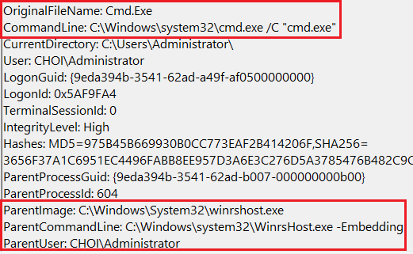

# WinRM / Powershell Remoting


WinRM (Windows Remote Management)는 윈도우의 WS-Management Protcol 구현이다. WS-Management SOAP (Simple Object Access Protocol)을 기반으로 각기 다른 밴더사에서 만들어낸 하드웨어와 운영체제가 소통할 수 있도록 해주는 프로토콜이다. 윈도우에서는 원격 호스트 코드/프로세스 실행을 위해서 자주 사용되고 있다.&#x20;

윈도우에서 기본적으로 원격 호스트 코드/프로세스 실행을 위해서 WMI등의 기술이 존재했지만, 이는 많이 오래되기도 했고 (1996), 유저 친화적이지 않았기 때문에 WinRM이 집중적으로 조명받기 시작했다. WinRM은 추후 파워쉘 리모팅 (Powershell Remoting) 기술의 기반이 되기도 한다.&#x20;

WinRM은 데브옵스 기술은 Ansible에서도 사용될 만큼 인프라 구축, 설정 등에서도 기본적으로 많이 사용된다. 윈도우 호스트에 WinRM이 기본적으로 설정되어 있지는 않지만, 왠만한 크기의 네트워크라면 WinRM이 기본적으로 사용되고 있다고 무방하다.&#x20;

### 전제조건

* 타겟 호스트의 로컬 관리자 권한.
* 타겟 호스트의 포트 5985 (HTTP), 5986 (HTTPS) 이 오픈되어 있으며, WinRM 설정 되어있음. &#x20;
* 윈도우 워크스테이션 - 별도 설정 필요&#x20;
* 윈도우 서버 - 기본적으로 설치, 설정되어 있으며 포트가 열려있음

### 공격&#x20;

WinRM 자체는 시스템 관리나 데브옵스에 이용되기 때문에 사실상 "공격"이라고 보기 어렵다. 공격자들 또한 시스어드민처럼 윈도우의 기능을 이용해 원격 호스트에 접근하고 있는 것이라고 봐야한다.&#x20;



인터렉티브 쉘을 위해서는 evil-winrm나 Metasploit, 단순한 명령 실행을 위해서는 cme를 이용한다.&#x20;

```
# evil-winrm 
apt install -y evil-winrm 
evil-winrm -i <FQDN/ip> -u <user> -p <pass> 

# Metasploit 
use auxiliary/scanner/winrm/winrm_login
set rhosts
set username
set password
set domain 
exploit 
sessions -l 

# CrackMapExec
cme winrm <IP/FQDN> -u <user> -p <pass> -d <domain> -X <파워쉘-명령어>
```



윈도우에서는 WinRM을 기반으로 만들어진 파워쉘 리모팅을 쓸수도 있고, WinRS LOLBAS 바이너리를 활용할 수도 있다.&#x20;

```
# 파워쉘 리모팅 (Powershell Remoting) 
Enter-PSSession -ComputerName <IP/FQDN> -Credential <domain\user>

# WinRS 
winrs -r:<FQDN/Netbios> "<명령어>"
winrs -r:dc01.choi.local "cmd /c hostname"
```



### 탐지/대응 방안&#x20;

WinRM 자체가 시스어드민/데브옵스에 실제로 사용되기 때문에 공격자들의 악성 행위를 탐지하기는 쉽지 않다. 단, WinRM이 실행 될때 어떤 프로세스가 실행되고, 그 프로세스들이 어떤 커맨드라인을 가진 다른 프로세스들을 실행하는지를 살펴보면 탐지/대응이 가능할 것이다.&#x20;

WinRM은 타겟 호스트에 접근해 명령어를 실행할 때 다음과 같은 프로세스 트리를 생성한다:&#x20;

* WinrsHost.exe -> cmd.exe /C  "<명령어>" -> 명령어로 실행된 프로세스&#x20;



관련된 윈도우 이벤트 ID로는 91 - Windows Remote Management - Request Handling이 있다. 이는 이벤트 뷰어의`Applications and Service logs -> Microsoft -> Windows -> Windows Remote Management -> Operational` 에서 확인할 수 있다.&#x20;

 (1) (1) (1).png>)

### 레퍼런스&#x20;







{% embed url="https://in.security/2021/05/03/detecting-lateral-movement-via-winrm-using-kql%EF%BF%BC/" %}
